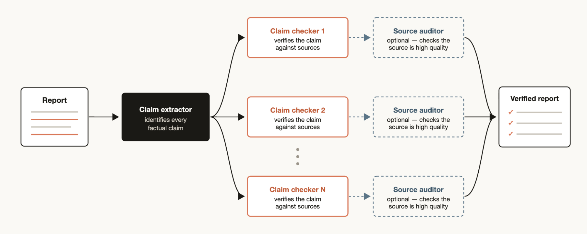

# 为每个任务配一套 harness：Claude Code 中的动态工作流

> Claude Code 现在可以现场编写并编排自己的多智能体 harness。本文讲解动态工作流的工作原理，以及最能发挥它们价值的使用模式。

上周，我们在 Claude Code 中发布了[动态工作流（dynamic workflows）](https://code.claude.com/docs/en/workflows)。Claude 现在可以现场编写自己的 [harness](https://code.claude.com/docs/en/glossary#agentic-harness)，为手头的任务量身定制。

虽然默认的 Claude Code harness 是为编码而构建的，但它对许多其他类型的任务同样有用——因为事实证明，很多任务都长得像编码任务。不过，有一些任务类别，我们过去必须在 Claude Code 之上构建定制 harness 才能达到峰值性能，比如[调研（Research）](https://support.claude.com/en/articles/11088861-using-research-on-claude)、[安全分析](https://support.claude.com/en/articles/11932705-automated-security-reviews-in-claude-code)、[智能体团队（agent teams）](https://code.claude.com/docs/en/agent-teams)或[代码审查（Code Review）](https://code.claude.com/docs/en/code-review)。

工作流让你可以在 Claude Code 之上动态创建 harness，使 Claude 能更原生地解决所有这些问题。你还可以把这些工作流分享给他人复用。

在这篇文章里，我会分享我使用工作流的初步体验和心得，帮助你把它用到极致。请记住：最佳实践仍在形成中——动态工作流通常消耗更多 token，最适合复杂、高价值的任务。

## 提示词示例

在深入技术细节之前，我想先给出几个提示词示例，帮你打开对工作流可能性的想象：

- "这个测试大概每 50 次跑挂 1 次。搭一个工作流来复现它。对竞态条件形成几个相互竞争的假设，直到只有一个假设能扛住证据为止，不要停。"
- "用一个工作流，翻我最近 50 个 session，挖出我反复在做的纠正，把高频出现的沉淀成 `CLAUDE.md` 规则。"
- "用一个工作流，挖一遍 Slack 里 #incidents 频道过去六个月的记录，找出那些反复出现、却没人建工单的根因。"
- "拿着我的商业计划书，跑一个工作流：让不同的智能体分别从投资人、客户和竞争对手的视角把它撕碎。"
- "这个文件夹里有 80 份简历，用一个工作流针对后端岗位排序，并复核前十名。先用 AskUserQuestion 工具采访我，生成一份评分标准（rubric）。"
- "我需要给这个 CLI 工具起名。用一个工作流头脑风暴一批选项，再跑一场锦标赛选出前 3。"
- "用一个工作流，把我们的 User 模型在所有地方重命名为 Account。"
- "过一遍我的博客草稿，用一个工作流对照代码库核实每一条技术断言——我不想发出去任何错的东西。"

## 动态工作流如何工作

动态工作流执行的是一个 JavaScript 文件，其中带有几个用于派生（spawn）和协调 [subagent](https://code.claude.com/docs/en/sub-agents) 的特殊函数：

*图注：工作流的特殊函数。`agent(prompt, opts?)` 派生一个 subagent，可选参数包括 `schema`（JSON Schema，产出经校验的 JSON 输出）、`model`（opus / sonnet / haiku，缺省则继承）、`isolation`（"worktree" 或 "remote"）、`agentType`（自定义或内置 subagent）；`parallel([fns])` 扇出并发运行，作为屏障等待全部完成；`pipeline(items, …)` 让每个条目依次流过每个阶段，无屏障。*

动态工作流同样包含 JSON、Math、Array 等标准 JavaScript 功能，用来处理数据。

特别值得知道的是：动态工作流可以决定某个智能体使用哪个模型、subagent 是否跑在自己的 worktree 里——也就是让 Claude 自行选择所需的智能等级与隔离程度。

如果工作流被打断（比如用户操作或退出终端），恢复该 session 后，工作流可以从中断处继续。

## 为什么需要动态工作流

当你让默认的 Claude Code harness 做一个任务时，它必须在同一个上下文窗口里既做规划又做执行。对许多编码任务而言这非常有效，但在长时运行、大规模并行、高度结构化和/或对抗性的任务上，它会失灵。

原因在于：Claude 在单个上下文窗口里处理复杂任务的时间越长，就越容易陷入几种特定的失败模式：

- **智能体式偷懒（Agentic laziness）**：Claude 在特别复杂的多部分任务完成之前就停下来，只取得部分进展就宣布任务完成——比如一次安全审查的 50 个事项只处理了 35 个。
- **自我偏好偏差（Self-preferential bias）**：Claude 倾向于偏爱自己的结果或发现，尤其是被要求按评分标准验证或评判它们的时候。
- **目标漂移（Goal drift）**：在多轮对话中对原始目标的保真度逐渐丢失，尤其是在压缩（compaction）之后。每一步总结都是有损的，边界条件要求、"不要做 X"这类约束细节都可能丢掉。

创建工作流能对抗这些失败模式：它编排彼此独立的 Claude subagent，每个都有自己的上下文窗口和聚焦、隔离的目标。

## 动态工作流 vs 静态工作流

你可能此前已经用 Claude Agent SDK 或 `claude -p` 创建过静态工作流，用来协调多个 Claude Code 实例协同工作。

但静态工作流必须覆盖所有边界情况，所以通常更加通用。有了 [Claude Opus 4.8](https://www.anthropic.com/news/claude-opus-4-8) 和动态工作流，Claude 现在已经足够聪明，可以为你的具体用例现写一套量身定制的 harness。

*图注：同一个问题——"我们该不该把结账服务迁到新供应商？"——静态 harness 走固定流水线（拆成 5 个网络搜索 → 抓取头部结果 → 核实 → 总结），产出一份泛泛的调研报告；动态工作流则先读你的计费代码（billing/、webhooks/、taxes/），再分头对照新供应商文档核对每个功能、按你的交易量测算价格，最后加一道"魔鬼代言人：反对迁移的最强理由"，产出一个具体的建议。*

## 使用动态工作流的常用模式

你只要直接让 Claude 建一个工作流，或者使用触发词 "`ultracode`" 来确保 Claude Code 创建工作流，就可以开始使用了。

但为动态工作流建立一个心智模型，会帮助你理解什么时候该用它们、以及如何通过提示词去引导 Claude。

Claude 在构建工作流时可能使用并组合以下几种常见模式：

*图注：六种工作流编排模式总览——分类后行动、扇出并合成、对抗验证、生成并过滤、锦标赛、循环至完成。*

### 分类后行动（Classify-and-act）

用一个分类器智能体判断任务类型，然后按任务路由到不同的智能体或行为。也可以在末尾用分类器决定输出。

### 扇出并合成（Fan-out-and-synthesize）

把任务拆成许多更小的步骤，每步跑一个智能体，然后合成这些结果。当小步骤数量很大、或每一步都受益于干净独立的上下文窗口（避免互相干扰、交叉污染）时特别有用。合成步骤是一道屏障（barrier）——它等待所有扇出的智能体完成，然后把它们的结构化输出合并成一个结果。

### 对抗验证（Adversarial verification）

为每个派生出来的智能体，再跑一个独立的智能体，按评分标准或准则对抗性地验证其输出。

### 生成并过滤（Generate-and-filter）

围绕一个主题生成一批想法，然后按评分标准或验证结果过滤、去重，只返回质量最高、经过检验的想法。

### 锦标赛（Tournament）

不是分工，而是让智能体竞争。派生 N 个智能体，每个用不同的方法尝试同一个任务，然后由提示词或模型驱动一个评判智能体，以两两比较的方式评判结果，直到决出胜者。

### 循环至完成（Loop until done）

对于工作量未知的任务，循环派生智能体直到满足停止条件（没有新发现、或日志里不再有错误），而不是跑固定的轮数。

## 使用场景

要有创造性地思考何时、如何让 Claude Code 创建动态工作流。我发现工作流有时对非技术工作甚至更有用。

### 迁移与重构

[Bun](https://bun.com/) 从 Zig 重写为 Rust 就是用工作流完成的。你可以在 [Jarred 的推文串](https://x.com/jarredsumner/status/2060050578026189172)里读到具体做法。

关键是把任务分解成一系列需要逐一处理的步骤，比如调用点（callsites）、失败的测试、模块等。为每个修复在 worktree 里派生一个 subagent 去改，再让另一个智能体做对抗性审查，然后合并。可以考虑告诉智能体不要使用资源密集的命令，这样你就能在不耗尽机器资源的前提下最大化并行。

### 深度调研

我们在 Claude Code 里发布了一个使用动态工作流的深度调研 skill（`/deep-research`）。具体来说，它扇出网络搜索、抓取来源、对抗性核查这些来源的断言，最后合成一份带引用的报告。

这类调研不止于网络搜索。比如，让 Claude 从 Slack 的上下文里汇编一份状态报告，或者通过深入探索代码库来调研某个功能是如何工作的。

### 深度核查

*图注：一个断言提取器（claim extractor）识别报告里的每一条事实断言；N 个核查智能体（claim checker）分别对照来源逐条验证；可选的来源审计员（source auditor）把关来源质量；最终汇成一份经核实的报告。*

反过来，如果你有一份报告，想对其中引用的每一条事实断言做核查和溯源，可以生成这样一个工作流：一个智能体识别出所有事实断言，然后为每一条派生一个 subagent 做细致核查。你还可以再加一个验证智能体去检查负责溯源的 subagent，确保其来源足够可靠。

### 排序

*图注：1000 个条目进入对阵表，每一场两两比较都交给一个全新（fresh）上下文的智能体，逐轮晋级（Round 1 → Round 2 → 决赛），最终归并出完整排序。*

你可能有一列条目，想按某种你相信 Claude Code 擅长评估的定性指标排序——比如按 bug 严重程度排序支持工单。但如果你试图在一个提示词里排 1000+ 行，质量会退化，上下文也装不下。正确做法是跑一场锦标赛、一条两两比较智能体组成的流水线（比较式评判比绝对打分更可靠），或者并行分桶排序再归并。每次比较都是一个独立的智能体，确定性的循环持有对阵表（bracket），上下文里只保留当前的排序结果（实时名次）。

### 记忆与规则遵从

*图注：对一个 diff，规则清单上每条规则各配一个验证智能体（各自干净上下文）逐条检查；被标记的疑似违规交给"怀疑论者"（skeptic）复核——是真违规还是误报？——最终只输出确认的违规。*

如果有一组规则 Claude 总是漏掉或做不好——即使已经写进了 `CLAUDE.md`——可以创建一个工作流，把规则列成清单，由验证智能体逐条检查：一条规则一个验证者。再创建一个"怀疑论者"人设的 subagent 复审这些规则是否合理，可以避免过多误报。

反方向同样成立：挖掘你最近的 session 和 code review 评论里反复出现的纠正，用并行智能体聚类，对每条候选做对抗验证（"这条规则真能防住一次真实错误吗？"），然后把幸存者蒸馏回 `CLAUDE.md`。

### 根因调查

调试的最佳做法是提出几个相互独立的假设并逐一检验，但如果只用一个上下文窗口，Claude 会陷入自我偏好偏差。

工作流可以在结构上防止这一点：派生多个智能体，从彼此不相交的证据出发生成假设——例如日志、文件、数据各一个智能体。每个假设随后要面对一个由验证者和反驳者组成的评审团。

这不只适用于代码。工作流可以用于销售（三月的销售额为什么掉了？）、数据工程（这条管道为什么挂了？），或任何事后复盘（post-mortem）演练。

### 规模化分诊

*图注：隔离检疫（quarantine）模式。左侧隔离区（QUARANTINE）里的阅读智能体只有只读工具、没有特权，负责阅读不可信内容、分类、与已跟踪事项去重，只向外输出结构化摘要；右侧可信区（TRUSTED）里的行动智能体持有高权限工具，只基于摘要行动、绝不接触原始内容——能修的开 PR 修，修不了的升级给人类。搭配 `/loop` 可持续运行。*

每个团队都有支持队列、bug 报告，或某种人力处理不完的积压。

分诊（triage）工作流对每个条目做分类、与已跟踪事项去重，然后采取行动——可能是尝试修复，也可能是升级给人类处理。

分诊工作流的一个有用模式是**隔离检疫（quarantine）**：禁止那些阅读不可信公开内容的智能体执行高权限操作，高权限操作改由负责"根据信息行动"的智能体执行。

把分诊工作流与 `/loop` 搭配，可以让 Claude 持续不断地做这件事。

### 探索与品味

在探索一个解法的不同方向时，工作流很有用——尤其是设计、命名这类品味型问题，它们受益于一份明确的评分标准。

试着让 Claude 探索一批解法，并给一个审查智能体一份"好解法长什么样"的评分标准。当审查智能体认为达标时任务才算完成。解法也可以基于评分标准，通过锦标赛来排序或筛选。

### 轻量评测（Evals）

你可以为特定任务跑轻量评测：在 worktree 里派生独立的智能体产出结果，再派生比较智能体按评分标准对具体输出进行比较和打分。例如，按特定标准评测并打磨你创建的某个 skill。

### 模型与智能路由

创建一个针对你的任务调优的分类器智能体，由它决定用哪个模型。当任务涉及大量工具调用、且执行前的调研能识别出最适合的模型时，这很有帮助。

例如，"解释 auth 模块是怎么工作的"这个任务的最佳模型，取决于 auth 模块有多少文件、代码库长什么形状。分类器智能体可以先做这个调研，再按预期复杂度路由到 Sonnet 或 Opus。

## 什么时候不该用动态工作流

工作流还很新。虽然在许多用例上它能创造超额回报，但并非每个任务都需要它，而且它可能消耗显著更多的 token。

最好把工作流用在创造性的地方，把 Claude Code 推向你以前没到过的地方。对常规编码任务，先问问自己：它真的需要更多算力吗？比如，大多数传统编码任务并不需要一个五人审查团。

同样的判断在上一层——架构层——也适用：[多智能体 vs 单智能体](https://claude.com/blog/building-multi-agent-systems-when-and-how-to-use-them)的抉择遵循类似的逻辑——并行与专业化必须挣回它们的协调成本。

## 构建动态工作流的技巧

### 提示词

使用上文描述的具体模式做详细提示，能让动态工作流产出最好的结果。

工作流不只服务于大任务。你可以提示模型使用"快速工作流（quick workflow）"——例如对某个假设做一次快速的对抗性审查。

### 与 /goal 和 /loop 组合

对可重复执行的工作流（如分诊、调研、核查），可以与 `/loop` 搭配定期运行，并用 `/goal` 设定硬性的完成要求。

### token 用量预算

你可以为动态工作流设置显式的 token 用量预算，限制一个任务消耗多少 token。直接在提示词里给预算即可，比如"用 1 万 token"，它会设置上限。

### 保存与分享动态工作流

在工作流菜单里按 "s" 可以保存工作流。你可以把它们签入 `~/.claude/workflows`，或通过 skill 分发。

*图注：工作流菜单。列出每个动态工作流的运行状态、智能体数量、token 用量与耗时，按 "s" 即可保存。*

通过 skill 分享时，把 JavaScript 工作流文件放进 skill 文件夹，并在 SKILL.md 里引用。为了保留更多弹性，你可能想提示 Claude 把 skill 里的工作流当作**模板**看待，而不是必须逐字执行的脚本。

*图注：把工作流文件（如 `verify-claims.workflow.js`）放进 skill 文件夹、与 SKILL.md 并列，并在 SKILL.md 里引用它。分享这个文件夹，任何安装该 skill 的人都能跑同一套工作流。*

## 一个新的探索起点

工作流是扩展 Claude Code 的一种有用的新方式。我鼓励你把它们当作一个起点，去探索让 Claude 帮你完成任务的新方法。关于怎么把它们用到最好，还有很多东西有待发现。欢迎告诉我你的发现。

关于"什么东西本来就该放进 harness"的原则，请参阅我们的[三种 harness 设计模式](https://claude.com/blog/harnessing-claudes-intelligence)。

*本文由 Anthropic Claude Code 团队的技术成员 Thariq Shihipar 与 Sid Bidasaria 撰写。*
