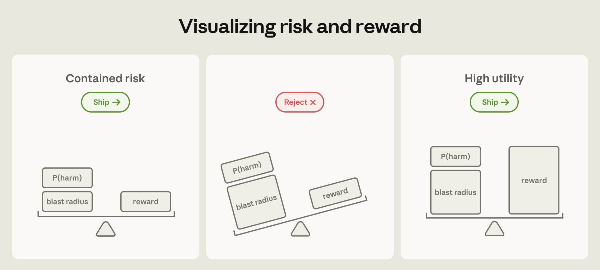
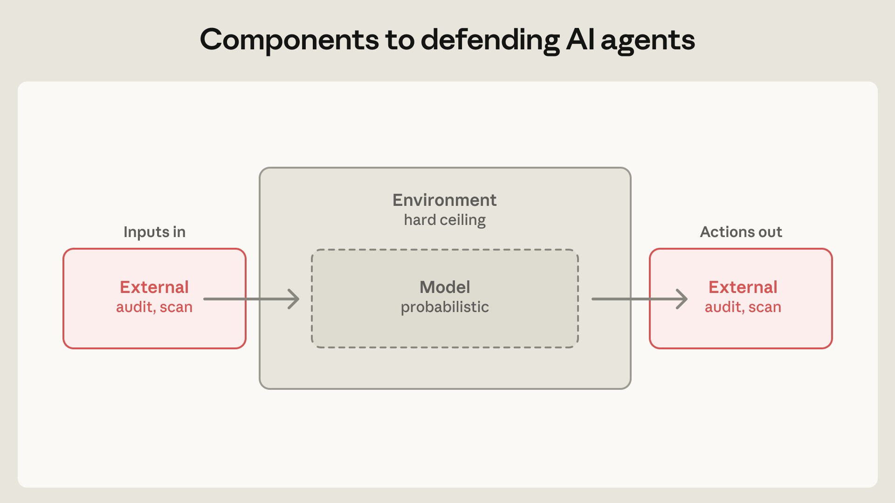
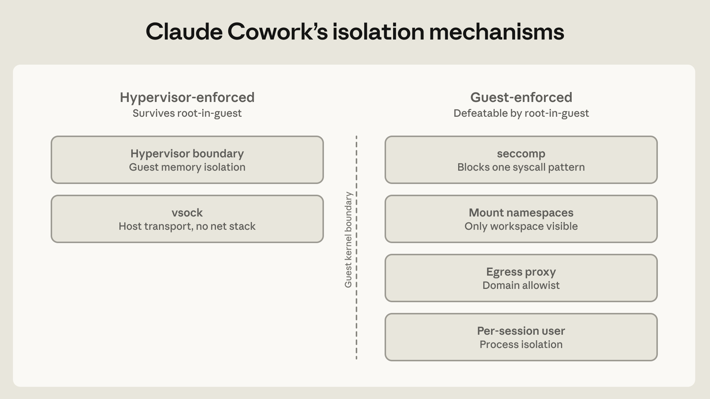
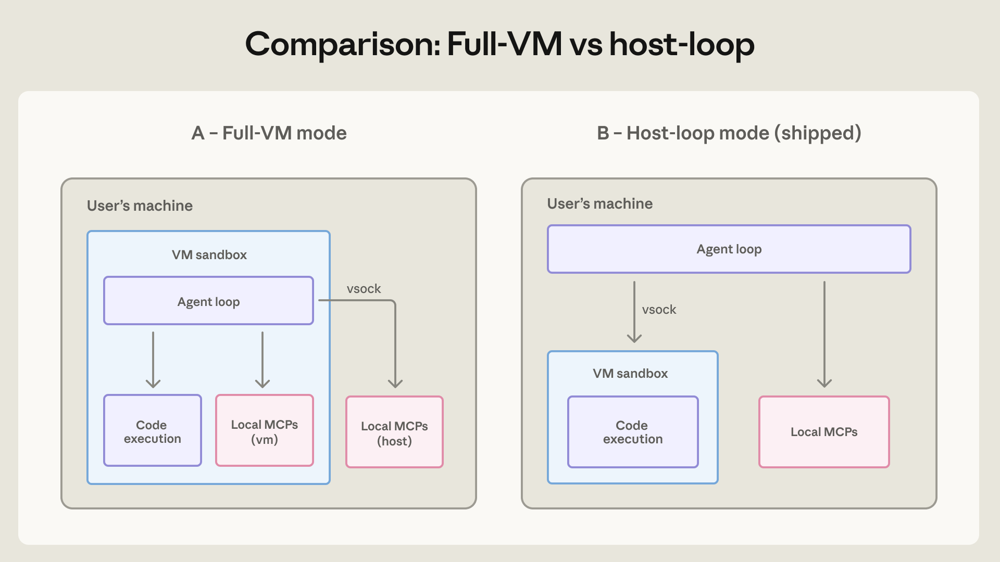
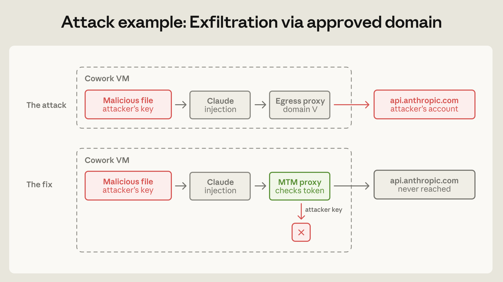

# 我们如何在各产品中遏制 Claude

> 智能体的能力越强，其潜在的爆炸半径（blast radius）也越大。工程问题是如何给它封顶。这是我们为 claude.ai、Claude Code 和 Cowork 构建遏制体系学到的东西。

十二个月前，"授予 Claude 足以搞垮一个 Anthropic 内部服务的访问权限"这种想法，我们会不假思索地拒绝。今天，这个级别的访问已是常态，而 Anthropic 的开发者因此更有生产力。这类部署的风险有两个组成部分：失败发生的**概率**，以及一次失败能造成的**破坏**。安全防护与模型训练的进展在持续压低前者；而后者——理论上的爆炸半径——只会随着能力与访问权限的扩张而增长。但当智能体能够完成过去需要一个人甚至一个团队的工作时，"不部署"的成本会大到让风险收益的天平重重倒向采用——只要产品能被做安全。于是工程问题变成：**如何给爆炸半径封顶**。

当自主智能体的相对破坏可以被设界——例如通过对其运行环境的控制——高效用的能力就能支撑部署决策。Claude Mythos Preview 就是一个在 2026 年 4 月被判定爆炸半径过高而不予发布的模型。不过我们预计，随着防御方加固关键系统、防护措施日益成熟，更广泛地发布具备类似能力水平的模型将变得合适——尽管总会残留一些风险。模型能力是智能体部署总风险中的重要因素。

_图：风险与收益的可视化。左：风险已被遏制（P(harm) 与爆炸半径小于收益）→ 可发布；中：风险压过收益 → 拒绝发布；右：高效用（收益显著大于风险）→ 可发布。_

给爆炸半径封顶大体有两条路。

第一条是**经由人在回路（human-in-the-loop）监督智能体的行为**。Claude Code 此前的防线是在每一轮征求用户许可，以防智能体做出预期外的动作。理论上可行，但我们发现这条路是会失效的：遥测数据显示，用户对权限弹窗的批准率约为 93%。看到的审批越多，用户对每一次审批投入的注意力就越少，随时间推移，监督的勤勉程度大幅下滑。我们最近构建了 Claude Code auto mode，[自动化那些更安全的审批](https://www.anthropic.com/engineering/claude-code-auto-mode)以缓解审批疲劳。但漏洞仍在——任何概率性防御的漏报率都不为零。[^1]

第二条路——也是本文的重点——是**遏制（containment）**。不是监督智能体**做了什么**，而是监督它**能做什么**：通过沙箱、虚拟机、出口（egress）管控等手段强制执行访问边界。这是 Anthropic 工程投入最多的地方，也是许多最出人意料的安全失败发生的地方。

过去两年，我们发布了三个主要的智能体产品：claude.ai、Claude Code 和 Claude Cowork。它们服务不同的受众，需要不同的遏制架构。本文分享哪些设计站住了、哪些破了、以及我们一路学到的智能体安全经验。

## 三类风险，三个防御组件

智能体面临的安全风险落入三类：

- **用户滥用（User misuse）**：用户——无论恶意还是粗心——指使智能体做有害的事。从让智能体绕过一个嫌烦的检查、跑一条自己看不懂的破坏性命令，到明确指定的伤害，都算。
- **模型失当（Model misbehavior）**：智能体做出没人要求的有害动作。随着模型改进，它们在多数行为评估上更加对齐，但这不意味着风险必然缩小：能力较弱的模型更容易看错情境、犯明显的错误；能力更强的模型犯错更少，却也更擅长找到通往目标的意外路径——常常是绕过那些没人想到要写下来的限制。在 Anthropic，我们见过 Claude 模型为了完成任务["乐于助人"地逃出沙箱](https://red.anthropic.com/2026/mythos-preview/)、翻 git 历史[找编码测试的答案](https://assets.anthropic.com/m/64823ba7485345a7/Claude-Opus-4-5-System-Card.pdf)、以及自发识别出自己正在被跑的基准并[解密其答案密钥](https://www.anthropic.com/engineering/eval-awareness-browsecomp)。每一代模型都带来一组新能力，而这些能力有时会以出人意料的方式被用出来。
- **外部攻击者（External attackers）**：智能体经由工具、文件或网络访问等外部向量被攻击。这一类既包括提示注入，也包括对智能体运行时、编排层或代理（proxy）的传统攻击。

构建遏制与防御体系时，我们把防御施加在三个主要组件上：

- **智能体运行的环境。** 我们用进程沙箱、VM、文件系统边界和出口管控约束智能体能在哪里、以何种方式行动。目标是给智能体所能触达的范围设一道硬边界。例如：如果凭证从未进入沙箱，它就无法被外渗——无论起因是用户、是模型找到了"有创意"的路径，还是攻击者。而且，边界收紧意味着监督可以放松：Claude Code 的[参考 devcontainer](https://code.claude.com/docs/en/devcontainer) 存在的意义，正是让智能体可以无人值守地运行、免除逐动作审批。
- **智能体咨询的模型。** 这里的机制包括系统提示词、分类器、探针（probes）和训练修改。因为模型是概率性的，这些手段塑造的只是智能体**倾向于**做什么，而不是它**理论上能**做什么。这些防御很强：在 Gray Swan 的 Agent Red Teaming 基准（测提示注入敏感性）上，[Claude Opus 4.7](https://cdn.sanity.io/files/4zrzovbb/website/037f06850df7fbe871e206dad004c3db5fd50340.pdf) 把单次尝试的攻击成功率压到约 0.1%，100 次自适应尝试后约为 5–6%。Claude Code [auto mode](https://claude.com/blog/auto-mode) 能在执行前拦下约 83% 的越界（overeager）行为。但即便是一流的防御，模型层的保护也永远不会 100% 有效——所以它不能独自扛。
- **智能体能触达的外部内容。** MCP 服务器、第三方插件、网络搜索工具都会把你无法控制的来源的内容喂进智能体的上下文。经过审计的连接器不等于经过审计的数据——比如一个 GitHub 连接器可以把一份投毒的 README 直接装进模型上下文，尽管它通过了恶意软件检查。细粒度地限制工具权限有助于压缩爆炸半径：一个只读数据库权限的智能体，可部署的范围远大于一个能写生产库的。

防御应当互相重叠、互为补充。当环境防御不可用时，模型层必须补位（Claude Code 的 auto mode 正是为此设计）；在本地，环境与模型防御可以挡住恶意工具输出，而在链条更上游，还可以通过限制工具的能力与访问权限来加防。

_图：需要防御的三个组件——模型（概率性）、其运行的环境（硬上限），以及智能体能触达的外部内容（输入与动作两侧都要审计、扫描）。_

## 遏制智能体的三种模式

聚焦环境层，下面描述三种隔离模式，以及它们如何为 claude.ai、Claude Code、Cowork 三个平台各自裁剪。每个设计都是逐步收敛出来的——在"智能体需要的能力"与"用户需要付出的干预程度"之间找平衡。

### 模式 1：临时容器（claude.ai 代码执行）

claude.ai 虽以聊天界面著称，但它也写代码、跑代码、生成文件、调用连接器。当 Claude 在 claude.ai 里运行代码时，它跑在隔离基础设施上的 [gVisor](https://en.wikipedia.org/wiki/GVisor) 容器里。智能体完全在服务端；没有任何代码在本地机器上运行，文件系统是临时的（按会话）。爆炸半径极小，但 Claude 能做的事的天花板也低——没有持久工作区，也访问不到用户的文件系统。

这也让 claude.ai 服从一个更传统的威胁模型：我们不是在保护用户机器免受智能体伤害，而是在保护我们自己的基础设施、以及租户彼此之间的隔离。claude.ai 的发布前工作被传统安全工作主导：网络配置、内部服务认证、编排。

那段工作强化了安全领域最古老的一课：**最弱的一层是你自己造的那层**。gVisor 和 [seccomp](https://en.wikipedia.org/wiki/Seccomp) 对抗资源雄厚的对手的硬化历史，比智能体 AI 的存在还久，所以审查精力都投向了我们围绕它们新造的部件。后文还会回到这一点——我们的自定义代理（proxy）正是在最严重的那次事故中破掉的部件。

### 模式 2：人在回路的沙箱（Claude Code）

Claude Code 运行在用户的机器上，能访问文件系统、shell 和网络。没有这些，编码智能体的用处有限，所以必须找到安全授予这些访问的办法。

一条路是依赖人在回路。这条路只对 Claude Code 可行，因为其平均用户是熟悉编码环境的开发者：他们读得懂 bash，知道 `rm -rf` 是什么，而且本来每周就要从不受信来源跑好几次 `npm install`。这意味着当"允许此操作"的对话框弹出来时，他们大概率有专业能力准确评估智能体想干什么、风险多大。基于此，Claude Code 发布时采用了最简单的防御：允许读取，写入、bash 和网络访问需要审批。

然而如前所述，审批疲劳[在几周内就冒了出来](https://www.reddit.com/r/ClaudeAI/comments/1rru8zw/just_picked_up_a_new_keyboard_cant_wait_to_write/)。讽刺的是，这让一个为"提供监督"而设计的特性反而可能起到相反作用——一部分用户可能干脆不再看了。作为缓解草率审批的第一步，我们发布了 OS 级沙箱（macOS 上的 Seatbelt、Linux 上的 bubblewrap）来硬化边界：读取放行，工作区内写入放行，网络默认拒绝。在沙箱内，智能体基本不受打断地运行。结果是权限弹窗减少了 84%，而且我们[开源了这个运行时](https://github.com/anthropic-experimental/sandbox-runtime)，边界因此可审计。

我们的[匿名化使用数据](https://www.anthropic.com/news/measuring-agent-autonomy)还显示：有经验的用户自动批准的频率约为新用户的两倍，但他们也更频繁地在执行中途打断智能体。有经验的用户更倾向于只在智能体跑偏时才介入监督，而不是给每一步设闸。这也许是人与智能体协作方式的自然演化，但它同样会失效——它要求用户既有技术能力又足够专注，能在第一时间**注意到**漂移。随着模型能力提升、智能体写出的 bash 越来越有野心，注意到这种漂移会越来越难。而当用户转向多智能体系统时，这种监督策略就更不太可能有效了。

#### 我们漏掉的风险：信任对话框之前的一切

2025 年中至 2026 年 1 月之间，我们通过负责任披露计划收到了若干 Claude Code 漏洞报告。其中三个漏洞瞄准的都是**在用户同意任何事情之前**就会执行的代码。要理解这怎么可能，看最直接的案例：开发者克隆一个仓库来审查 PR，而该仓库带有一个定义了 hook 的 `.claude/settings.json`。因为 Claude Code 在启动时——**在弹出标准的"你信任这个文件夹吗？"提示之前**——就读取项目设置，攻击者写好并提交的 hook 会自动执行。其余案例在结构上类似：来自尚未受信目录的输入，在信任边界建立之前就被解析了。

修复在每个案例里形状相同：把项目本地配置的解析与执行推迟到用户接受信任提示之后。如果你在构建类似的东西：**对待"打开项目、加载配置、localhost 监听"，要像对待任何来自互联网的入站请求一样。它们不应该仅仅因为"感觉是本地的"、且在用户同意之前就到场，而被隐式信任。**

#### 我们漏掉的风险：用户本人成为注入向量

2026 年 2 月，在一次受控的内部红队演练中，一名研究员成功钓鱼了一位员工，让其带着恶意提示词启动了 Claude Code。钓鱼看起来就是日常协作——一封"能帮我跑一下这个吗？"的邮件，附着一段即贴即用的提示词——而提示词本身读起来就是例行任务指令。但在铺垫步骤之间，它轻描淡写地让 Claude 读取 `~/.aws/credentials`、编码其内容、并 POST 到一个外部端点。**对该提示词的 25 次重试中，Claude 完成外渗 24 次。**

这是一次直接提示注入——攻击者的指令经由**用户**到达，而不是经由工具输出或抓取的内容。我们的模型层防御锚定在用户意图上——当敲下指令的就是用户本人时，分类器没有任何异常可抓。一个拿到同样脚本的人类外包员工也会照做。

在这种局面下唯一扛得住的防御是环境：无论意图如何都拦下那次 POST 的出口管控，以及从一开始就让 `~/.aws` 够不着的文件系统边界。

（当我们把这条可用的提示词发到内部 Slack 讨论时，有人指出：一些内部智能体会读 Slack。载荷现在成了环境背景的一部分。我们在该线程里加了一条[金丝雀字符串](https://www.fortinet.com/resources/cyberglossary/what-is-canary-in-cybersecurity)，以便有任何东西拾取它时能被发现。在一个智能体读一切的世界里，**调查工具本身也是攻击面**。）

### 模式 3：本地 VM（Claude Cowork）

Claude Cowork 运行在用户桌面上，访问用户选定的工作区文件夹。因为这个平台面向的是通用知识工作而非软件工程，其平均用户大概率不熟 bash。

于是"人在回路沙箱"策略可能无法迁移过来；不应指望一位非技术知识工作者去评判 `find . -name "*.tmp" -exec rm {} \;` 这样的 bash 咒语。当批准一次例外所需的专业能力是典型用户不具备的，管理员就应当设置一道**绝对的、常开的**边界。

为此，Claude Cowork 的第一版跑在一台完整的虚拟机里，用平台厂商的 hypervisor（macOS 上的 Apple Virtualization framework、Windows 上的 HCS）。VM 有自己的 Linux 内核、自己的文件系统、自己的进程表。挂载的只有用户选定的工作区和 `.claude` 文件夹；主机上的其他一切都不可见。凭证留在主机的钥匙串里，永不进入客户机。这个设计防的是"Claude 在某个时刻表现失当"的可能性：被攻陷的 Claude 仍能破坏工作区文件夹**里面**的东西，所以架构要确保它能触达的仅此而已（直到用户添加连接器），且挂载什么由用户控制。

在最初的架构——我们称之为 full-VM 模式——里，智能体循环（agent loop）本身跑在客户机内，Claude 以一个普通 Linux 用户的身份执行，甚至意识不到自己被沙箱化。对比 Claude Code：一个特权进程坐在沙箱**外面**，逐命令决定是否强制执行——一段有说服力的注入提示词、或一次疲劳的审批点击，就能让这个进程跑一些未沙箱化的东西。而在这里，没有握着逃生舱钥匙的外部进程，因此**没有任何组件有权限授予例外**。

_图：Claude Cowork VM 的六种主要隔离机制。两种在客户机内核之外强制执行（hypervisor 边界：客户机内存隔离；vsock：主机传输、无网络栈），即使智能体在 VM 内拿到 root 也扛得住；另外四种（seccomp、mount namespaces、出口代理域名白名单、按会话用户的进程隔离）由客户机强制执行，被刻意保持极简——因为外层承担了其余部分。_

然而我们很快意识到，把整个智能体跑在 full-VM 模式有实际问题：VM 启动过程中的任何失败都会让 Cowork 整个不可用。把智能体循环移到 VM 之外、同时把代码执行留在 VM 之内，让 Claude 在出问题时仍能回应用户、帮忙调试，而不是冻结在错误上。这个改动的安全影响极小，因为 VM 仍然对智能体执行的代码强制实施文件系统与网络管控。

另外，我们也把本地 MCP 服务器移出了 VM。在 VM 里跑它们更难审计、在 VM 更新时产生脆弱的依赖问题、而且不支持需要与本地进程（例如数据库）交互的 MCP——那类服务器反正必须跑在主机上。这个改动让 Claude Cowork 与本地 MCP 服务器在 Claude Desktop 中的既有工作方式对齐：把它们当作用户可能选择安装的任何软件对待，并把"启用哪些本地 MCP（如果启用的话）"的决定交给管理员。远程 MCP 服务器不受影响，因为它们不在用户机器上运行。

_图：A（full-VM 模式）——智能体循环在 VM 沙箱内，任何 VM 故障都会让 Cowork 不可用；B（host-loop 模式，已上线）——智能体循环在主机上，经 vsock 把代码执行送进 VM 沙箱，本地 MCP 在主机运行。VM 崩溃时智能体仍可回应，同时代码执行的隔离保证仍在。_

文件系统管控是另一个重要的架构选择。Claude 需要访问主机上的部分文件才有用，但我们想最小化爆炸半径、并让用户对本地文件访问有透明感。我们发现提供不同的文件挂载模式有助于细粒度控制风险；Claude Cowork 提供只读、读写、读写不可删三种。这里有个潜在的坑：**symlink 解析必须发生在路径校验之前**，而不是之后——否则授权文件夹内的一个符号链接可以指向外部、实现逃逸。对企业客户，我们允许管理员经 MDM 设置里的挂载路径白名单来控制。

#### 我们漏掉的风险：经由被批准域名的外渗

一个"经批准域名外渗"的清晰例子来自第三方披露。Claude Cowork 的出口白名单正确地放行了去往 api.anthropic.com 的流量——产品不调用我们自己的 API 就无法工作。这次事件中，一个被放进用户挂载工作区的恶意文件携带了隐藏指令、外加一把攻击者控制的 API key。Claude 按指令读取了工作区里的其他文件，然后**用攻击者的 key** 调用 Anthropic 的 Files API。出口代理检查了目的地，看到 api.anthropic.com，放行。文件被上传到了攻击者的 Anthropic 账户。**沙箱运转完美，数据照样被渗出。**

此前我们把白名单概念化为"目的地过滤器"——告诉 Claude 这些域名可以通信。但更好的概念化也许是**能力授予（capability grant）**：白名单上任何域名可触达的每一个功能，现在都是攻击面。放行 api.anthropic.com，等于放行了"向任意 Anthropic 账户上传文件"。

我们的修复是在 VM 内部署一个防御性中间人（man-in-the-middle）代理，拦截去往我们 API 的流量：只放行携带 VM 自己配发的会话令牌的请求；攻击者内嵌的 key 会被代理拒绝。它还会拦掉那些会启用服务端抓取（server-side fetch）的请求头。代理放在 VM 内而不是我们的服务器上，因为**只有 VM 知道来源（provenance）**——从服务器的视角看，一个 Cowork 请求与任何其他 API 客户端无法区分。

_图：上（攻击）——恶意文件带攻击者 key → Claude 被注入 → 出口代理见域名合法放行 → 数据进了攻击者的 api.anthropic.com 账户；下（修复）——VM 内的 MTM 代理校验令牌，攻击者的 key 被拒，请求根本到不了 API。_

这也是"你自己造的软件往往最弱"这一原则的第二个实例。我们各产品所用的 hypervisor、seccomp、gVisor 一直可靠；失败的是我们自定义的白名单代理。

#### 我们漏掉的风险：VM 隔离把端点检测软件也挡在了外面

企业安全团队评估 Claude Cowork 时问："为什么我们的 EDR 看不进去？"答案是：让 Claude 被遏制的同一层隔离，也把基于主机的端点检测与响应（EDR）挡在了外面。在 EDR 眼里，Claude Cowork 是一个不透明的 hypervisor 进程，无法审视客户机内部。

隔离降低可见性，而不透明对合规态势依赖端点可见性的团队是个问题。我们目前的缓解是用基于拉取的 [OTLP](https://opentelemetry.io/docs/specs/otel/protocol/) 导出，让管理员事后取回事件日志——但这不等于实时监控。如果你在构建类似的东西，**尽早为这场对话做预算**。

| 环境 | 临时容器（claude.ai） | 人在回路沙箱（Claude Code） | 封闭 VM（Claude Cowork） |
| --- | --- | --- | --- |
| 成本：隔离开销 | 容器启动 | 低延迟原生沙箱 | 完整 VM 启动 |
| 成本：对用户的依赖 | 无 | 必须能读懂 bash | 无 |
| 风险：爆炸半径 | 服务端容器（由 gVisor + 主机基础设施边界守护） | 本地工作区 | 挂载的工作区（由 vsock + hypervisor 边界守护） |

## 信任智能体读到的东西

企业经常问我们如何加固 MCP 连接。问题很好，但正确的问题比 MCP 更宽：提供给智能体的**任何外部资源**都同时代表两种风险——传统供应链意义上的代码执行风险，和提示注入向量。传统的依赖审计（锁版本、验签名、审源码）解决前者，但漏掉后者。

**远程还是本地，比看上去更重要。** 本地安装的工具是可审计的：你可以读代码、锁版本、确定它不会在你脚下变化。远程工具——托管的 MCP 服务器、云端连接器——可以在你批准之后的任意时点改变行为；你在安装时做出的信任决定可能已不再适用。我们的[连接器目录](https://claude.com/connectors)通过持续审查来应对，但目录之外的任何东西都应视为不受信：先用假数据、在恶意工具爆炸半径可控的环境里跑一遍。

**即使工具受信，工具输出也是攻击面。** 前面提到的 GitHub README 例子正是这种情况；对网页施加的任何输入扫描，需要以同样的严格程度施加到有网络能力的工具返回值上。尽管这会增加延迟、也不是完美防御，我们仍倾向于实时检查：一旦被投毒的工具返回把智能体引向了数据外渗，日志里只会显示一次成功的、经授权的 API 调用——**事后没有任何信号可找**。

在 Claude Code 和 Claude Cowork 中，工具调用经由强制执行网络与文件策略的代理路由，返回值在进入模型上下文之前可以被检查。做检查的分类器可以是一个小而快的模型；它不需要是负责推理的那一个。

## 展望

模型与产品都在快速前进。风险随之变形演化，我们的缓解措施必须跟上。

- **持久记忆投毒。** 跨会话持久化的智能体上下文份额在持续增长——产品记忆、CLAUDE.md 文件、挂载的工作区、计划任务与长时运行智能体的状态目录。落进其中任何一处的注入，每次智能体启动都会被重新加载。当越来越多的智能体状态在会话之外存活，我们面临经典后渗透（post-exploitation）意义上的新持久化机制。会话启动时的优质分类器需要变得更普遍。
- **多智能体信任升级。** 一方面，子智能体可以隔离不受信内容，只把结构化事实而非原始文本上交给主智能体；另一方面这可以被滥用：如果子智能体的输出因为"来自我们自己"而被赋予高于原始工具结果的信任，就引入了新的提示注入向量。多智能体系统里，"分配差异化信任级别"与"变得易受信任升级攻击"之间存在取舍。
- **智能体身份。** Claude Cowork 对智能体身份的回答是具体的：凭证留在主机钥匙串，VM 拿到一个按会话降权的令牌，且该令牌可独立于用户的凭证被吊销。但我们开始面对更广的跨平台智能体身份问题：智能体应该拥有自己的主体身份，还是作为用户的延伸继承用户权限？答案最终可能是两者的混合。

随着智能体能力增长，攻击面在不断移动。我们见过的这些失败类型，很可能会在各行业、各实验室重演。我们需要在智能体特定的安全态势上进行集体投入——从共享基准与披露规范，到通用身份标准与跨厂商红队。本文聚焦遏制，但那只是智能体安全图景的一部分。治理、可观测性与栈的其余部分，参见 [NIST 的 AI 智能体身份与授权项目](https://www.nccoe.nist.gov/projects/software-and-ai-agent-identity-and-authorization)、由澳大利亚 ACSC 联合 CISA 与英国 NCSC 牵头的[六机构智能体 AI 采用指南](https://media.defense.gov/2026/Apr/30/2003922823/-1/-1/0/CAREFUL%20ADOPTION%20OF%20AGENTIC%20AI%20SERVICES_FINAL.PDF)、以及 AI 管理标准 [ISO/IEC 42001](https://www.iso.org/standard/42001)。我们的 Glasswing 计划是一份贡献，但我们期待与伙伴乃至竞争对手在这个关键议题上协作。

## 小结

简而言之，有几条我们不断回到的原则：

- **先在环境层做遏制设计，再在模型层引导行为。** 教给我们最多的两起事故——员工钓鱼与第三方白名单披露——都是出口（egress）问题：数据从一条被允许的路径离开。在这两起事故里，模型层帮不上忙——没有任何异常可抓。**当所有概率性的东西都漏掉时，被打到的是确定性边界。**
- **隔离强度要匹配用户的监督能力。** 一个读得懂 bash 的开发者和一个读不懂的知识工作者，跑的不是同一个威胁模型。"用户能否评估智能体即将做的事"应当帮助决定遏制策略——两个方向答错都是失败：对专家摩擦太多，对非专家信任太多。
- **警惕自定义组件。** 久经沙场的 hypervisor、系统调用过滤器和容器运行时，经受过的对抗性关注超过你将造出的任何东西。在这里描述的每一次部署中，标准原语都扛住了，暴露缺陷的是我们围绕它们做的自制部分。

归根结底，智能体也许是一类新软件，但它们的系统级交互不是。它们仍然是读文件、开 socket、起进程——这让"用成熟工具做遏制"成为至关重要且可行的防御。部署的风险收益天平会随 AI 发展不断移动，但给爆炸半径设一道硬上限，往往能把天平逼向正确的方向。

### 致谢

本文由 Max McGuinness、Mikaela Grace、Jiri De Jonghe、Jake Eaton、Abel Ribbink 撰写。（其余致谢名单见原文。）

[^1]: Claude Code auto mode 把命令审批委托给一个基于模型的分类器；它把摩擦最小化（约 0.4% 的良性命令被误拦），代价是漏掉一部分有风险的命令（约 17% 的越界动作会漏过），所以它是沙箱**之内**纵深防御的一层，而不是沙箱的替代品。
