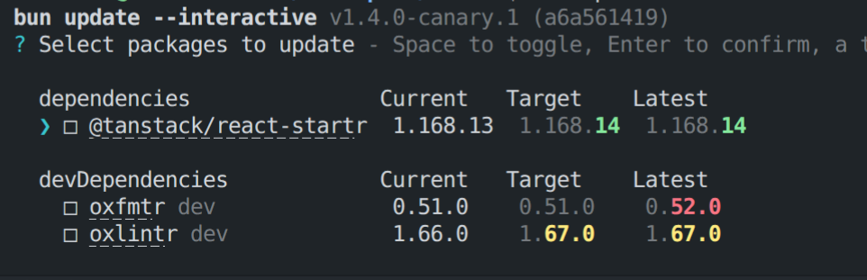
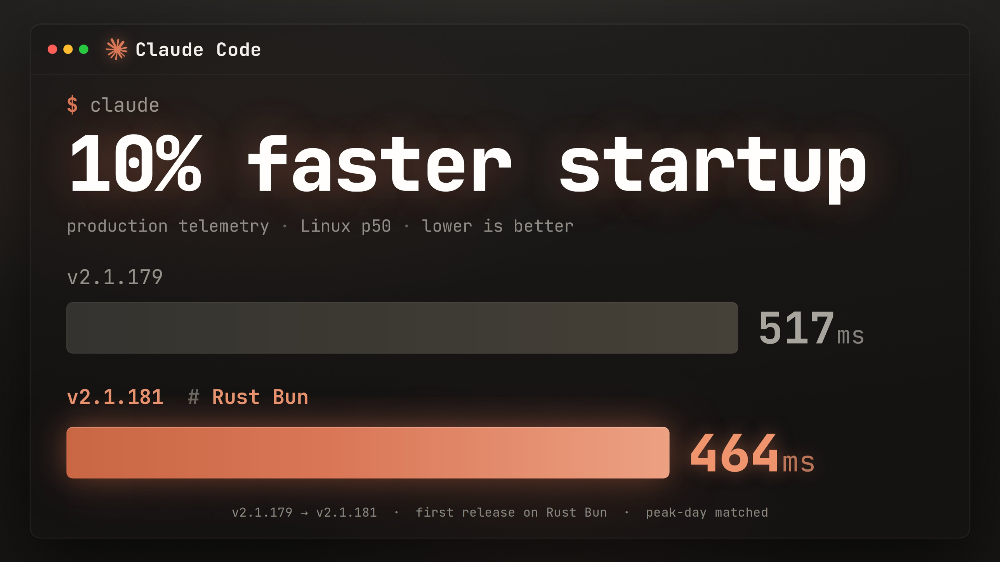

# 用 Rust 重写 Bun

> **译注：** 原文正文含 2 张静态插图（已入库 `imgs/bun-in-rust/`）与 5 个交互式数据组件（返工排行榜、提交打点卡、编译错误工作队列、CI 失败燃尽图、移植过程回放），后者依赖原站 JavaScript，无法静态收录，在对应位置以译注说明。

> **披露：** Bun 于 2025 年 12 月被 Anthropic 收购。我和 Bun 团队的其他成员都在 Anthropic 工作。这次 Rust 重写的大部分工作使用的是预发布版本的 Claude Fable 5。

Bun 最初是把 esbuild 的 JavaScript & TypeScript 转译器从 Go 逐行移植到 Zig 的产物。我在 [2021 年 4 月 16 日](https://github.com/ziglang/zig/issues/8575)写下第一行 Zig。当年我在 Hacker News 上看到单页的 [Zig Language Reference](https://ziglang.org/documentation/master/)，对其底层控制力和对性能的用心非常兴奋，于是押注了 Zig。

从一开始，Bun 的范围就非常庞大：

- JavaScript、TypeScript 和 CSS 的转译器、压缩器和打包器
- npm 兼容的包管理器
- 类 Jest 的测试运行器
- Node.js & TypeScript 兼容的模块解析
- HTTP/1.1 & WebSocket 客户端
- `fs`、`net`、`tls` 等数十个 Node.js API 模块的实现

Bun 的初版是我在奥克兰一间局促的公寓里、在没有 LLM 的年代、用一年时间以 Zig 写出来的。像 Bun 这样野心勃勃的项目，默认结局是躺进 GitHub 个人主页上死掉的副业项目坟场。是 Zig 让 Bun 成为可能。如果没有 Zig，我绝不可能在一年内造出这么多东西。

如今，Bun 的 CLI 月下载量超过 2200 万。Claude Code 和 OpenCode 等流行工具把 Bun 作为它们的运行时。Vercel、Railway、DigitalOcean 等平台对 Bun 提供一等支持。

Bun 的范围也一直是稳定性的挑战。这是我们在 Bun v1.3.14 里修复的 bug 的一小部分样本：

> - `node:zlib` 中的 heap-use-after-free 崩溃：在线程池上还有异步 `.write()` 进行中时对 zlib、Brotli 或 Zstd 流调用 `.reset()`
> - `node:zlib` 中的 use-after-free 崩溃：`onerror` 回调对原生句柄发起可重入的 `write()` 后接 `close()`
> - `node:http2` 中的 use-after-free 崩溃：可重入 JS 回调（如超时监听器、options getter 或 write 回调内的 `session.request()`）触发哈希表 rehash，使内部流指针失效
> - `UDPSocket.send()` 与 `sendMany()` 中的 use-after-free：用户在 `valueOf()` 或 `toString()` 回调中的代码可以在载荷捕获与实际发送之间 detach 一个 `ArrayBuffer`
> - `Buffer#copy` 与 `Buffer#fill` 的崩溃和越界读：参数强制转换期间 `valueOf` 回调 detach 或 resize 底层 `ArrayBuffer`
> - `UDPSocket.sendMany()` 的堆越界写：套接字连接状态在迭代中途被用户 JS 回调改变
> - `crypto.scrypt` 的内存泄漏：输出缓冲区分配失败时回调和受保护的密码/盐缓冲区从未释放
> - `SSLWrapper.init` 在错误路径上泄漏 strdup 的 passphrase
> - `tlsSocket.setSession()` 的内存泄漏：因缺少 `d2i_SSL_SESSION` 之后的 `SSL_SESSION_free`，每次调用泄漏一个 `SSL_SESSION`（每次约 6.5 KB）
> - `fs.watch()` 监视器在 `.close()` 后从不被垃圾回收的内存泄漏：引用计数下溢把每个监视器永久钉成 GC root
> - CSS 解析器的 double-free 崩溃：`background-clip` 带厂商前缀且是多层背景时
> - `DuplexUpgradeContext` 从未释放——每次 `tls.connect({ socket: duplex })` 都完整泄漏一次
> - `MessageEvent` 的竞态崩溃：GC 标记线程可能在 `BroadcastChannel` 或 `MessagePort` 并发访问期间观察到 `m_data` 中撕裂的变体

我们本可以永远这样一个一个地修下去，但对指望着我们的用户来说，我们欠他们一个更好的做法：系统性地防止这类 bug 再次发生。

### 我们当时已经在做的事

- 我们给 Zig 编译器打了补丁以支持 Address Sanitizer。每次提交都用 ASAN 跑测试套件。
- 我们在 Windows 上发布 Zig 安全检查的 ReleaseSafe 构建
- 我们用 [Fuzzilli](https://github.com/googleprojectzero/fuzzilli)（V8 和 JavaScriptCore 使用的 JavaScript 引擎模糊测试器）7×24 小时模糊测试 Bun 的运行时 API
- 我们有大量端到端内存泄漏测试

这已经比许多项目做得多了。

## "变得非常聪明并且不犯错"就行了吗？

我们的 bug 修复清单让人难受，我也厌倦了每晚带着对 Bun 崩溃的担忧入睡。我不怪 Zig——其他 Zig 用户没有我们这些 bug，而"把 GC 和手动管理内存混在一起"这种需求罕见到没有语言真正为它设计。没有 Zig 我们走不到今天，我永远心怀感激。直到最近，编程语言的选择对 Bun 这样的项目来说都是一锤子买卖。

JavaScript 是垃圾回收语言，JavaScriptCore（和 V8）这类现代 JavaScript 引擎对异常处理和垃圾回收器有严格的规则。Zig 像 C 一样不替你管理内存——对许多项目而言这种取舍正是使用 Zig 的好理由。Zig 没有构造/析构函数，绝大多数清理都要在每个调用点用 `defer` 显式写出来。

对 Bun 来说，正确处理"垃圾回收值"与"手动管理值"的生命周期一直是稳定性问题的主要来源——最常见的是小的内存泄漏，偶尔是崩溃。每一次内存分配都必须被仔细审查：这些字节在哪里释放？如何保证只释放一次？JavaScript 异常检查对了吗？这个垃圾回收指针对保守栈扫描器可见吗？这是 GC 内存还是手动管理内存？

对稳定性问题来说，越早知道越好。模糊测试发生在代码合并之后。CI 发生在代码推送之时。运行时安全检查和 address sanitizer 发生在代码运行之时（最好在开发阶段、CI 之前）。

减少这类问题的常见办法之一，是确保需要清理的代码总是恰好执行一次清理。Zig 的设计追求简单、没有隐藏控制流，所以它偏好显式的 `defer` 关键字在作用域结束时执行代码，而不是 C++ 隐式的 ~Destructor 或 Rust 隐式的 `Drop`。

| 语言 | 清理机制 |
| --- | --- |
| Zig | `defer`、`errdefer` |
| C++ | ~Destructor、&&Move |
| Rust | Drop |

对 Zig 代码来说，清理代码到底该在什么时候跑？如果同一个 `*T` 被传给许多不同的函数，我们怎么知道它何时不再可达、可以清理？当某些函数在调用结束后还需要继续引用这块内存时又该怎么办？我们当时的做法是混用：

- arena 生命周期，用在可达范围清晰的场景（解析器状态不会逃出调用函数，AST 节点是好例子）
- 引用计数
- 打起十二分精神

许多项目选择用风格指南来回答这类问题。Zig 世界有 TigerBeetle 的 [TigerStyle](https://tigerstyle.dev/)，还有 Google 那份 31,000 词的 [C++ 风格指南](https://google.github.io/styleguide/cppguide.html)。风格指南的难题是执行：你怎么确保它被遵守？历史上答案是代码评审，辅以 linter 和静态分析器的尽力而为。

用类型系统把所有权预期显式写死的严格风格指南，对 Bun 是一个真实的选项。由于 Zig 没有运算符重载，我们大概率会写出一堆这样的代码：

```zig
fn foo(a_ptr: SharedPtr(TCPSocket)) !void {
  const a: *TCPSocket = a_ptr.get();
  defer a_ptr.deref();

  const b = try do_something_with_a(a);
  defer b.deref();

  // ...
}
```

这比我们期望的 Zig 写法笨重得多：

```zig
fn foo(a: *TCPSocket) !void {
  const b = try do_something_with_a(a);
  // ...
}
```

## 那 C/C++ 呢？

Bun 约 20% 的代码是 C++，还内嵌了若干 C/C++ 库：

- JavaScriptCore——驱动 Safari 的 JavaScript 引擎
- uWebSockets & usockets——我们的 HTTP/WebSocket 服务器和事件循环
- lshpack & lsquic——`HPACK` 和 HTTP/3 库
- BoringSSL——Google 的 OpenSSL 分支
- SQLite

用 C++ 替代 Zig 对 Bun 是个合理选择：能拿到构造/析构函数，能删掉大量 `extern "C"` 包装代码。

但我们仍然要依赖靠代码评审执行的风格指南，而且即使有 ASAN，内存损坏和内存泄漏依然会发生。

## 为什么是 Rust？

那份 bug 清单里很大比例是 use-after-free、double-free 和"错误路径上忘了 free"。在 safe Rust 里，这些是编译错误，外加 `Drop` 提供的类 RAII 自动清理。**编译错误是比风格指南更好的反馈回路。**

历史上，重写是个糟糕主意。不算注释，Bun 有 535,496 行 Zig。换语言重写要一小队工程师干整整一年，意味着这段时间冻结 bug 修复、安全修复和功能开发。要得到可发布的东西，风险最小的路径是从 Zig 到 Rust 的**机械式移植**：行为变更最少化，并沿用我们本来就在用的同一套测试套件。

幸运的是，Bun 自己的测试套件是 TypeScript 写的，这意味着它不依赖运行时的实现语言。

"一年对用户零产出"不是我们能认真考虑的选项。所以"靠代码风格执行来修稳定性问题"曾是我们的最优解——我们当时的计划就是给 Bun 代码库加上 Rust 风格的[智能指针](https://github.com/oven-sh/bun/blob/3a79bd746b11601c9db970b608c73f0b9f96ac81/src/ptr/shared.zig#L569)。

但说实话，我不想这么干。自研智能指针的工效比 Rust 差，还没有任何 Rust 的保证。

那么，换个思路：花一周测试一下 Anthropic 的新模型能不能用 Rust 重写 Bun？

起初我并不指望它能成。几天之后，测试套件的通过率开始走高，我看到新的 Rust 代码与原 Zig 代码库的贴合程度，我的看法从"值得一试"变成了"我要合并它"。

## Claude，用 Rust 重写 Bun。

把这件事搞砸的方式有很多。比如，向 Claude 提示"用 Rust 重写 Bun。别犯错。"然后祈祷成功——这不是我的做法。

想想人会怎么做这件事。第一个大问题是：

> 增量重写？还是一次性全部重写？

以我当年（没有 LLM 时）把 esbuild 转译器从 Go 移植到 Zig 的经验，一次性全部重写更好。增量重写会引入你希望最终被删掉的临时代码，短中期都很痛苦。

第二个大问题：怎么做？

如何让 Rust 版 Bun 保持与之前同一个 Bun——相同的架构、性能和功能集——同时获得借用检查器这样的 Rust 语言特性？如何确保团队在重写之后还能维护它？

答案：做一次**看起来像把 Zig 代码转译成 Rust**的重写。等 Bun v1.4 发布后，我们再逐步重构，减少 `unsafe`，让它更像地道的 Rust。

大问题只有这两个。其余都是战术。

## 写代码与评审代码的循环

软件工程师的大量日常工作可以过度简化成循环：

```js
// Pseudocode, not real code:
let task;
while ((task = todoList.pop())) {
  const result = task();
  const feedback = await Promise.all([review(result), review(result)]);
  await apply(feedback, result);
}
```

一个 `task` 带着上下文（Jira 工单、GitHub issue 等）。`result` 是你为它写的代码。代码评审者 `review` 变更，检查回归与正确性。然后你处理反馈。

**我用大约 50 个 Claude Code dynamic workflows、连续运行 11 天，用 Rust 重写了 Bun。**

每个 dynamic workflow 都是这样一个循环——分别负责：

- 生成一份移植指南，把 Zig 模式与类型映射到 Rust 模式与类型
- 把每个 `.zig` 文件机械地移植成 `.rs` 文件，对齐 PORTING.md 与 LIFETIMES.tsv
- 修复每个 crate 的编译错误
- 让 `bun test`、`bun build` 这类子命令跑起来
- 让 Bun 整个测试套件的每一个测试通过
- 若干大型重构和清理批次

那 11 天的大部分时间（以及之后），我都在监控这些 workflow——人工阅读输出、检查问题和 bug，并提示 Claude 修改循环本身来修复问题。

一个 +100 万行的 PR 怎么评审？如何开始建立起负责任地合并大量 LLM 编写代码所需的信心？

**一套语言无关、带百万断言的测试套件；对抗式代码评审；以及当真出了问题时，修复生成代码的流程，而不是手改代码。**

### 对抗式评审

对抗式评审是让（另一个独立上下文窗口里的）Claude 穷尽一切理由，论证这些变更会制造 bug 或不能工作。

#### 切分上下文窗口

人类协作中，评审代码的人通常不是写代码的人。写代码的人想合并代码，这会让其行为偏向"没准备好也先发了"。

Claude 也一样。写代码的 Claude 希望代码被接受；评审的 Claude 希望找出代码的问题。

**1 名实现者，每名实现者配 2 名以上对抗评审者。评审者唯一的工作：找 bug、找代码不能工作的理由。实现者不评审，评审者不实现。**

> **译注：** 原文此处是一个交互式"返工排行榜"（rework leaderboard）组件，展示各文件被反复返工的次数排名，静态归档无法收录。

## 实际长什么样？

如果你要做一件大而昂贵的事，先去风险（de-risk）能省时间也省钱。

### 准备工作

在写任何代码之前，我花了约 3 小时和 Claude 讨论如何把我们 Zig 代码库的模式贴近地映射到 Rust。Claude 把这场讨论序列化成一份 `PORTING.md` 文档，后来还上了 [Hacker News](https://news.ycombinator.com/item?id=48016880)。

下一个问题：如何给手动管理内存的代码加上 Rust 生命周期？

于是我给了 Claude 大致这样的提示：

> 我：我们来启动一个 dynamic workflow，分析代码库中每个结构体字段的正确生命周期。这个 workflow 应该读取每个文件里每个结构体字段并追踪控制流。首先找出在 Rust 中生命周期难以表达的结构体字段，然后为该字段提议一个生命周期，再用 2 个对抗评审 agent 评审这个生命周期，然后应用反馈，并序列化成一份 LIFETIMES.tsv 给其他 claude 看。

然后再对 `PORTING.md` 和 `LIFETIMES.tsv` 一起做一轮对抗评审，修复相互冲突的建议并复查一切。我自己也人工通读了一遍。

### 试运行

在让 Claude 翻译全部 1,448 个 .zig 文件之前，我先从 3 个开始。对这 3 个文件中的每一个：1 名实现者写出新的 `.rs` 文件，2 名对抗评审者检查 `.rs` 文件与 `.zig` 文件行为一致、且遵循 `PORTING.md` 和 `LIFETIMES.tsv`。之后由 1 名修复者应用所有建议。

### 假启动

我让 Claude 在全部 1,448 个 .zig 文件上循环这个 workflow，大约 2 分钟后，一个 Claude 在提交前跑了 `git stash`。另一个跑了 `git stash pop`。接着是 `git reset HEAD --hard`。它们在互相踩踏！而如果给每个 Claude 一个独立 worktree，磁盘会不够用——Bun 的 git 仓库太大，而且这些变更最终需要被一起编译、一起看到。

于是我让 Claude 修改 workflow，指示 Claude 永远不要运行 `git stash`、`git reset`，或任何不是"一次提交一个特定文件"的 `git` 命令。`cargo` 也不行。任何慢命令都不行。

然后 Claude 恢复了 workflow。跑起来了！但太慢，于是我把它切成 4 个 workflow 分片，每片有自己的 worktree（共 4 个 worktree），每片跑 16 个 claude，逐文件提交和推送。

### 终于开始写代码

得益于所有这些并行化和准备工作，峰值时 Claude 每分钟写约 1,300 行代码。每一行代码都经过两名独立对抗评审者（也是 Claude）评审，并在提交前过一轮修复。此时这些代码完全还跑不起来。

> **译注：** 原文此处是一个交互式"提交打点卡"（commit punchcard）组件，展示 11 天内提交的时间分布，静态归档无法收录。

注意到时间分布不均匀了吗？我忘了调高这台 EC2 实例的默认 IOPS。一条慢 `grep` 命令就足以让磁盘读写冻结好几分钟。

### 编译错误即工作队列

写完所有代码之后，我让 Claude 写一个 workflow 修复每一个编译错误。我们按 crate 逐个推进。

> **译注：** 原文此处是一个交互式"错误工作队列"组件，展示各 crate 编译错误的消解过程，静态归档无法收录。

最棘手的一类错误是循环依赖。

我们的 Zig 代码库是单一编译单元（等效于一个 crate）。我想把新的 Rust 代码库拆成约 100 个 crate 让编译更快，但这需要在避免循环依赖的同时尽量少改动原 Zig 实现。我在 Rust 重写启动前提的[那个 PR](https://github.com/oven-sh/bun/pull/30224) 不够用。与其推倒重来，我跑了另一个 workflow 去归类"有循环依赖的代码应该放哪"并全部写下来——然后再用一个 workflow 执行这次重构。

修完循环依赖暴露出约 16,000 个编译错误。对 1 个人类是天文数字，对同时跑着的 64 个 claude 不算疯狂。

为了最大化并行，workflow 按 crate 循环：

- 对每个 crate 运行 `cargo check`，把输出按文件分组、错误存入文件
- 修复该 crate 内的所有编译错误
- 2 名对抗评审者评审该 crate 的变更
- 1 名修复者应用修复

为了防止 claude 互相踩踏，`cargo check` 只在最开始跑一次，而且和其他环节一样，结束前不碰 `git`。

#### 又一次假启动

Claude 把"让所有 crate 编译通过"理解成了"把有编译错误的函数打成桩（stub）"。Claude 还开始添加可疑的长解释性注释来给绕过方案找理由，于是我给对抗评审者加了这条否决规则：

> 如果你需要一段一整段的注释来论证这个绕过方案没问题，那代码就是错的——去修代码。

一次提示词修改、几个小时后，这些行为就绝迹了。

### 冒烟测试

模型很爱说"冒烟测试"这个词。

`cargo check` 通过之后，下一步是让它编译出来并跑 `bun --version`。先是链接错误，接着一启动就 panic。

再下一个目标是跑通 `bun test`。这一步通了，我们就能开始跑测试了！于是又一个 workflow，按 bun CLI 子命令循环：

- 把每个失败的堆栈追踪连同其子命令存入文件
- 按子命令分组的每个失败堆栈，派 1 个 Claude 修复
- 2 名对抗评审者
- 1 名修复者应用建议

### 让测试套件在本地通过

这个 workflow 按测试文件循环。

随机抽取约 100 个测试文件，按代码库目录切成 4 片分给 4 个 worktree。对每个失败的测试：把堆栈与错误存入文件，1 名实现者提出修复，2 名对抗评审者评审，然后 1 名修复者应用。

#### 更多假启动

我们的测试套件里有大量内存泄漏测试，还有一批耗时可超过一分钟的集成测试——例如一个跑 `next dev` 并验证热更新能连续 100 次感知变更的测试。其中若干在 debug 构建下会超时。

我们还有把机器 TCP 套接字数量打满的压力测试、对磁盘读写数 GB 的测试、以及孵化约 1 万个进程的测试。

这需要比"拜托了"更强的隔离，于是我们用 `systemd-run`（cgroups）限制内存和 CPU 用量并隔离 pid 命名空间。即便如此，机器还是数次磁盘写满、崩溃。

### 让测试套件在 CI 通过

第一次 CI 运行两天后，失败清单从 972 个测试文件降到 23 个。又过了一天半，Linux 全绿——那是第一次，我感到这次 Rust 重写真的要成了。

> **译注：** 原文此处是一个交互式"CI 失败燃尽图"组件，静态归档无法收录。

之后到合并前的路都很直接。一个 workflow 按平台循环修复 CI 测试失败直到清零。另有几个 workflow 处理 Windows 相关清理、去重代码、减少 unsafe 用量、以及一般性代码清理。

### 合并 Rust 重写

当 Bun 的测试套件在所有平台的 CI 上 100% 通过（**并且我人工核实了这些测试确实在运行、没有被跳过**）之后，我在本地跑了一堆命令做测试——然后按下了合并按钮。

合并进 `main` 并不是版本化发布。这个时点，我的信心足以向前推进、押注这次重写，但还不足以发布它。

### 数据

峰值时我们同时跑 4 个这样的 workflow，各在独立 worktree 中，每个 workflow 16 个 Claude。**同时约 64 个 Claude。**

> **译注：** 原文此处是一个交互式"移植过程回放"组件，静态归档无法收录。

#### 0 个测试被跳过或删除

11 天（5 月 3 日 → 5 月 14 日合并）· 6,778 次提交

| 平台 | expect() 调用 | 测试数 | 文件数 |
| --- | --- | --- | --- |
| Debian 13 x64 | 1,386,826 | 60,624 | 4,174 |
| macOS 14 arm64 | 1,259,953 | 58,850 | 4,175 |
| Windows 2019 x64 | 1,007,544 | 57,337 | 4,173 |

合并之前，这一共消耗了 59 亿未缓存输入 token、6.9 亿输出 token、720 亿缓存输入 token 读取——按 API 定价约 165,000 美元。若由人工完成，我估计需要 3 名对代码库有完整上下文的工程师约一年时间，期间我们将无法改进 Node.js 兼容性、修 bug、修安全问题或实现新功能。我们绝不会那么做。现实中的替代方案是什么都不做，永远修着本文开头那些 bug。

这是当今可能性的最前沿。我用的是预发布版本的 [Claude Fable 5](https://www.anthropic.com/news/claude-fable-5-mythos-5)（Mythos 级模型）。Claude Code 的 dynamic workflows 让 64 个 Claude 连跑了 11 天（不然我就得自己写一个 harness 才能办到）。

### 工作还在继续

合并 Rust 移植以来，我们完成了 [Claude Code Security](https://claude.com/product/claude-security) 的 11 轮安全评审并处理了发现的问题。

我们还给 Bun 的每一个解析器加上了 7×24 的覆盖率引导模糊测试——JavaScript、TypeScript、JSX、CSS、JSON5、JSONC、TOML、YAML、Markdown、INI、Bun Shell 脚本、semver 区间、.patch 文件和 CSS 颜色。模糊测试器发现 bug 后自动发给 Claude 提交一个"复现 + 修复"的 PR，由人类评审这些 PR。至今它已执行我们的解析器 1000 亿次，产出了约 15 个 PR。

截至写作时，Bun 的 Rust 代码约 4% 位于 `unsafe` 块内（约 78 万行中的约 2.7 万行、约 1.3 万个 `unsafe` 关键字），其中 78% 的块只有一行——一个来自 C++ 的指针，或一次对 C 库的调用。随着我们从忠实的 Zig 移植（Zig 没有可 grep 的 `unsafe` 关键字）重构为地道的 Rust，我预计这个数字会下降；但我们会继续使用 JavaScriptCore 等 C/C++ 库，所以它的 `unsafe` 永远会比纯 Rust 项目多。

### 移植错误

这次 Rust 重写的焦点是稳定性，但发布如此巨大的变更而不引入任何回归是不可能的。

这次重写引入了 **19 个已知回归，每一个都已修复**。

大多数回归来自**在两种语言里语法相同、语义不同**的代码。

#### `debug_assert!` 里的副作用

这两段代码看着相似，行为却不同。Zig 的 `assert` 是函数，参数在每种构建下都会执行。Rust 的 `debug_assert!` 是宏，release 构建里整个表达式（包括那次 `insert_stale` 调用）都会被擦除。

```zig
// Zig:
if (dev.framework.react_fast_refresh) |rfr| {
    assert(try dev.client_graph.insertStale(rfr.import_source, false) == IncrementalGraph(.client).react_refresh_index);
}

// Rust:
if let Some(rfr) = &dev.framework.react_fast_refresh {
    debug_assert!(dev.client_graph.insert_stale(&rfr.import_source, false)? == react_refresh_index);
}
```

`insert_stale` 把文件加入前端 dev server 的热更新图。release 构建里它不再执行，于是某些场景下 HTML 路由 + React 项目在热更新文件失效时 HMR 崩坏：`Cannot destructure property 'isLikelyComponentType' of 'k'`。debug 构建一切正常。[#30678](https://github.com/oven-sh/bun/issues/30678)

#### 奇数长度的切片

Bun 的 Zig 辅助函数 `reinterpretSlice(u16, bytes)`（早于内建的切片转换）用 `@divTrunc` 并忽略末尾的奇数字节。`bytemuck::cast_slice` 遇到它会直接 panic。对"UTF-16 字节序标记后跟奇数个字节"调用 `Blob.text()` 不再返回字符串，而是让进程 panic。我们改回忽略奇数字节：`&buf[..buf.len() & !1]`。[#31188](https://github.com/oven-sh/bun/issues/31188)

#### 边界检查

在 macOS 和 Linux 上，我们的 Zig 代码用 `ReleaseFast` 编译，它会移除边界检查。Rust 的 release 构建保留边界检查。

Bun 的模块解析器把长文件名 intern 进一个会溢出到 overflow 块的全局列表。原 Zig 代码把每块大小定为 `count / 4`（即 2048）。移植时留了一个占位符：

```rust
/// ... so use a nonzero stand-in until Phase B threads the
/// per-instantiation value through.
pub const BSS_OVERFLOW_BLOCK_SIZE: usize = 64;
```

这把 interned 文件名上限从 840 万降到 270,272——真实项目会撞上——并让一个从 Zig 原样移植过来的 `ptrs[4095]` off-by-one 变得可达。Rust panic 了，而不是越界写。如果我们用 `ReleaseSafe`（我们只在 Windows 上用了），Zig 在这种情况下同样会 panic。[#31503](https://github.com/oven-sh/bun/issues/31503)

#### `comptime` 格式字符串

`Output.pretty` 把颜色标记重写成 ANSI 转义。在 Zig 里 `fmt` 是 `comptime` 的，所以标记在参数替换之前就被处理掉了。Rust 函数没有 comptime 参数，于是 `Output::pretty` 只能看到拼接完成的字符串，把参数里的内容也当标记重写了。

```zig
// Zig:
pub inline fn pretty(comptime fmt: string, args: anytype) void;
Output.pretty("<r>{f}<r>", .{hyperlink});

// Rust:
pub fn pretty(payload: impl PrettyFmtInput);
Output::pretty(format_args!("<r>{}<r>", hyperlink));
```

`bun update -i` 用 [OSC 8](https://gist.github.com/egmontkob/eb114294efbcd5adb1944c9f3cb5feda) 超链接打印包名，以 `ESC \` 结尾。那个反斜杠正好位于尾部标记 `<` 之前，标记解析器把它吞了，`r` 就作为文本打了出来。



在 Rust 里它必须是宏：`bun_core::pretty!("{}", hyperlink)`。[#30693](https://github.com/oven-sh/bun/issues/30693)

## Rust 版的 Bun 更好

到目前为止，Bun v1.4.0 修复了 128 个在 v1.3.14 中可复现的 bug，从内存泄漏、崩溃到帮助文本的配色错误。

### 内存占用下降

Rust 有一个强大的语言级内存清理工具：`Drop`。实现了 `Drop` 后，值离开作用域时 `drop` 函数会自动调用。

```rust
impl Drop for Bytes {
    fn drop(&mut self) {
        if !self.pinned.is_empty() {
            JSC__JSValue__unpinArrayBuffer(self.pinned);
        }
    }
}
```

在 Zig 里，`defer` 可以在作用域结束时执行代码：

```zig
const bytes: ArrayBuffer = try .fromPinned(global, value);
defer bytes.unpin();
```

Zig 的 `defer` 需要加在每一个可能需要清理的调用点。很容易忘了清理（内存泄漏），或在很少走到的错误处理代码里清理两次（double-free）。Rust 的 `Drop` 在值不再可达时自动运行——用"无隐藏控制流"换来了对一个常见坑的免疫。

`Drop` 修复了 Bun 中若干与错误处理路径中文件路径相关的内存泄漏。

#### 我们修复了每一个可检测的内存泄漏

我们改进了 Bun 的 [LeakSanitizer](https://clang.llvm.org/docs/LeakSanitizer.html) 集成，以追踪[全部原生代码内存分配](https://github.com/oven-sh/bun/pull/30875)。

举个例子：每次进程内 `Bun.build()` 调用都会泄漏数 MB 内存——解析后的源码文本和 AST 符号表活得比它们所属的构建更久。

```js
// Bundle the same 60-module project 2,000 times in one process
for (let i = 0; i < 2_000; i++) {
  await Bun.build({
    entrypoints: ["./index.js"],
    minify: true,
    sourcemap: "external",
  });
}
```

Bun v1.3.14 中，每次构建永久泄漏约 3 MB——dev server 这类每个请求都打包一次的工具最终会耗尽内存。Bun v1.4.0 中，内存走平：

| 构建次数 | Bun v1.3.14 | Bun v1.4.0 |
| --- | --- | --- |
| 500 | 1,914 MB | 526 MB |
| 1,000 | 3,506 MB | 586 MB |
| 1,500 | 5,097 MB | 608 MB |
| 2,000 | 6,745 MB | 609 MB |

之前[在 Zig 里做同样事情的尝试](https://github.com/oven-sh/bun/pull/24741)没有被合并，因为缺少 `Drop` 的等价物让人难以有信心合并。

### 更小的二进制体积

Rust 重写的初始变更让二进制体积在 Windows 上缩小 3.8 MB、macOS 上 5.5 MB、Linux 上 6.8 MB。主要因为我们的 Zig 代码用了过多 `comptime`。

> **译注：** 原文此处内嵌了 [Bun 官方账号 2026-05-18 的推文](https://x.com/bunjavascript/status/2056510566018203971)（附二进制体积对比图），静态归档无法收录。

在这次初始缩减之后，团队继续探索二进制体积优化：链接器层面的 Identical Code Folding、移除 ICU 中未使用的数据、以及用 zstd 字典按需惰性解压 libicu 的小片段。

结合 Rust 重写、ICU 变更和 Identical Code Folding，Bun 的二进制体积在 Linux 和 Windows 上缩小约 20%。

| 版本 | 平台 | 体积 |
| --- | --- | --- |
| Bun v1.4.0 (canary) | Windows | 76 MB |
| Bun v1.3.14 | Windows | 94 MB |
| Bun v1.4.0 (canary) | Linux | 70 MB |
| Bun v1.3.14 | Linux | 88 MB |

### 栈空间占用下降

TOML 解析器，以及 Bun 里所有其他递归下降解析器（JSON、YAML、JavaScript、TypeScript 等）现在使用更少的栈空间。

这在 Rust 重写合并之前曾导致一些测试失败：

```js
bun test v1.3.14-canary.1 (e99311e58)
.......

105 | });
106 |
107 | it("Bun.TOML.parse throws on deeply nested inline tables instead of crashing", () => {
108 |   const depth = 25_000;
109 |   const deepToml = "a = " + "{ b = ".repeat(depth) + "1" + " }".repeat(depth);
110 |   expect(() => Bun.TOML.parse(deepToml)).toThrow(RangeError);
                                               ^
error: expect(received).toThrow(expected)

Expected constructor: RangeError

Received function did not throw
Received value: {
  a: {
    b: {
      b: {
        b: {
          b: {
            b: {
              b: {
                b: {
                  b: [Object ...],
                },
              },
            },
          },
        },
      },
    },
  },
}

      at <anonymous> (/var/lib/buildkite-agent/build/test/js/bun/resolve/toml/toml.test.js:110:42)

✗ Bun.TOML.parse throws on deeply nested inline tables instead of crashing [2907.64ms]
```

Rust 的 LLVM IR 代码生成会为不再使用的栈变量发出 LLVM 的 [`llvm.lifetime.start`](https://llvm.org/docs/LangRef.html#llvm-lifetime-start-intrinsic) 和 [`llvm.lifetime.end`](https://llvm.org/docs/LangRef.html#llvm-lifetime-end-intrinsic) 内建标记，让 LLVM 可以复用栈槽位。带嵌套作用域的大函数因此显著减少栈空间使用。

此前我们靠[把特别大的函数重构成许多小函数](https://github.com/oven-sh/bun/pull/15993)来人工绕过 Zig 的[一个未解 issue](https://github.com/ziglang/zig/issues/23475)。

### 快 2% - 5%

Rust 支持 C/C++ 与 Rust 之间的跨语言链接时优化（LTO），可以跨编程语言内联（这也太酷了！！）。

我们在 Linux x64（EC2，Xeon Platinum 8488C）上对比了 Bun v1.3.14 与 Bun v1.4.0。HTTP 吞吐用 [oha](https://github.com/hatoo/oha) 压 hello-world 服务器，应用负载用 [hyperfine](https://github.com/sharkdp/hyperfine) 测量。

HTTP 吞吐（req/s，3 轮平均）

| 服务器 | Bun v1.3.14 | Bun v1.4.0 | Δ |
| --- | --- | --- | --- |
| Bun.serve | 169.6k | 177.7k | +4.8% |
| node:http | 103.8k | 108.5k | +4.5% |
| Elysia | 158.9k | 163.3k | +2.8% |
| express | 64.5k | 66.6k | +3.2% |
| fastify | 91.5k | 95.9k | +4.8% |

应用 / CLI（hyperfine）

| 负载 | Bun v1.3.14 | Bun v1.4.0 | Δ |
| --- | --- | --- | --- |
| next build | 13.62 s | 13.03 s | +4.5% |
| vite build (tsc + vite) | 1.69 s | 1.65 s | +2.2% |
| tsc -b --force | 0.94 s | 0.89 s | +4.7% |

## 生产环境

Prisma 在 Bun 的 Rust 重写上发布了 [Prisma Compute](https://www.prisma.io/blog/bun-rust-rewrite-prisma-compute) 公测。

> "我们曾遇到内存泄漏，以及 VM 暂停恢复后无法恢复的连接池。Rust 重写出现后，我们用同样的故障模式测试它。它完美扛住了。" —— Alexey Orlenko

Claude Code v2.1.181（6 月 17 日发布）及之后的版本使用 Rust 移植版的 Bun。Linux 上启动快了 10%，除此之外几乎没人察觉。**无聊是好事。**



## 发布

Bun v1.3.14 是最后一个用 Zig 写的 Bun。Bun v1.4.0 将是第一个用 Rust 写的 Bun。canary 渠道现已可用——发现任何问题请报告：

```sh
$ bun upgrade --canary
```

## 可维护性

对我和团队来说，新的 Rust 代码库与旧的 Zig 代码库感觉非常相似。举个例子，这是原 Zig 代码与新 Rust 代码的对照片段：

```zig
pub fn canMergeSymbols(
    scope: *Scope,
    existing: Symbol.Kind,
    new: Symbol.Kind,
    comptime is_typescript_enabled: bool,
) SymbolMergeResult {
    if (existing == .unbound) {
        return .replace_with_new;
    }

    if (comptime is_typescript_enabled) {
        // In TypeScript, imports are allowed to silently collide with symbols within
        // the module. Presumably this is because the imports may be type-only:
        //
        //   import {Foo} from 'bar'
        //   class Foo {}
        //
        if (existing == .import) {
            return .replace_with_new;
        }

        // ...
    }

    // ...
}
```

```rust
pub fn can_merge_symbol_kinds<const IS_TYPESCRIPT_ENABLED: bool>(
    scope_kind: Kind,
    existing: symbol::Kind,
    new: symbol::Kind,
) -> SymbolMergeResult {

    if existing == symbol::Kind::Unbound {
        return SymbolMergeResult::ReplaceWithNew;
    }

    if IS_TYPESCRIPT_ENABLED {
        // In TypeScript, imports are allowed to silently collide with symbols within
        // the module. Presumably this is because the imports may be type-only:
        //
        //   import {Foo} from 'bar'
        //   class Foo {}
        //
        if existing == symbol::Kind::Import {
            return SymbolMergeResult::ReplaceWithNew;
        }

        // ...
    }

    // ...
}
```

任何理解原 Zig 代码的人都能理解机械翻译后的 Rust 代码。我评审这个最初的 Rust 重写 PR 的方式是：检查对抗代码评审 agent 确实在捕获 Zig 代码与 Rust 代码之间的不一致、确实在确保移植指南和生命周期指南被遵守，同时我自己也把大量代码 Zig vs Rust 并排人工读过。

## 接下来

Bun v1.4 让 Bun 更快、更小、更省内存，并给团队带来了系统性改进稳定性的强力工具：Rust 的借用检查器、Miri（CI 中已对越来越多的代码运行）、LeakSanitizer，以及针对解析器的 7×24 覆盖率引导模糊测试。[要重构的还很多](https://bun.com/bun-unsafe-audit)，但开局非常好。

这次 Rust 重写若由对代码库有完整上下文的工程师团队来做，要一年的工作量。1 名工程师使用 Fable 并密切监控 Claude Code，我们从启动到测试套件在所有平台 100% 通过，用了 11 天。

**今天，一个工程师能做到的事比一年前多得多。**
