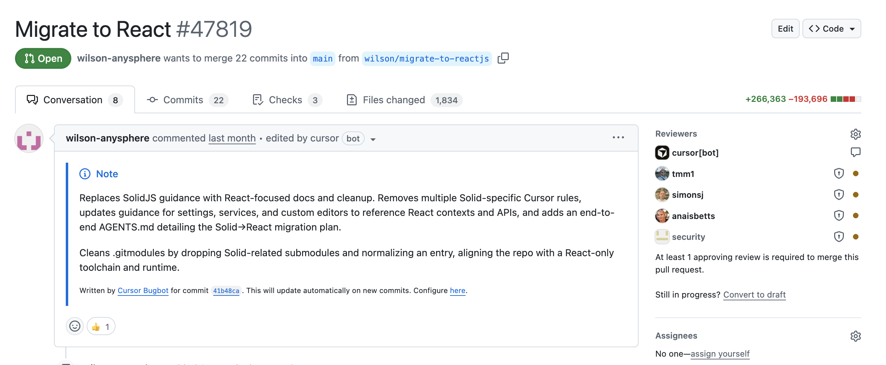

# 规模化长时自主编码

我们一直在实验让编码智能体自主运行**数周**。

我们的目标是弄清楚：对于那些通常需要人类团队数月才能完成的项目，我们能把智能体编码的前沿推到多远。

这篇文章描述我们从"数百个并发智能体在单一项目上运行、协调它们的工作、看着它们写下超过一百万行代码和数万亿 token"中学到的东西。

## 单智能体的极限

今天的智能体擅长聚焦的任务，但对复杂项目太慢。自然的下一步是并行运行多个智能体，但如何协调它们是个难题。

我们的第一直觉是：提前规划会太死板。穿过一个大项目的路径是模糊的，正确的分工在开始时并不明显。所以我们从**动态协调**开始——让智能体根据其他智能体正在做的事，自己决定做什么。

## 学习协调

我们最初的方案给所有智能体平等地位，让它们通过一个共享文件自我协调。每个智能体查看别人在做什么、认领一个任务、更新自己的状态。为了防止两个智能体抢到同一个任务，我们用了锁机制。

这以一些有趣的方式失败了：

智能体会把锁握太久，或者干脆忘记释放。即便锁机制正确运转，它也成了瓶颈：**20 个智能体会慢化到两三个智能体的有效吞吐量**，大部分时间花在等待上。

系统很脆：智能体可能在持锁时挂掉、试图获取自己已经持有的锁、或者根本不拿锁就去更新协调文件。

我们尝试用**乐观并发控制**替换锁：智能体可以自由读状态，但如果状态在读取之后被改过，写入就会失败。这更简单也更健壮，但还有更深的问题。

**没有层级，智能体会变得风险规避。** 它们回避困难任务，转而做小而安全的改动。没有智能体为难题或端到端的实现负责。这导致工作长时间空转而无进展。

## Planner 与 worker

我们的下一个方案是**分离角色**。不再是人人什么都做的扁平结构，而是一条职责分明的流水线：

**Planner** 持续探索代码库并创建任务。它们可以为特定领域派生 sub-planner，让规划本身也是并行且递归的。

**Worker** 领取任务并全身心完成它。它们不与其他 worker 协调，也不操心大局，只是死磕自己被分配的任务直到完成，然后推送变更。

在每个周期结束时，一个 **judge** 智能体判定是否继续，然后下一轮迭代以全新状态开始。这解决了我们绝大多数协调问题，让我们能扩展到非常大的项目，而不会有任何单个智能体患上隧道视野（tunnel vision）。

## 运行数周

为了测试这套系统，我们把它指向一个有野心的目标：**从零构建一个网页浏览器**。智能体们跑了近一周，写下了分布在 1,000 个文件里的超过 100 万行代码。你可以[在 GitHub 上浏览源码](https://github.com/wilsonzlin/fastrender)。

尽管代码库这么大，新智能体仍能理解它并做出有意义的推进。数百个 worker 并发运行、推送到同一条分支，冲突极少。

_图：FastRender 渲染真实网页。虽然看上去只是一张普通的截图，但从零构建一个浏览器是极其困难的。_

另一个实验是把 Cursor 代码库从 Solid 就地迁移到 React。它跑了三个多星期，产生 +266K/−193K 的编辑量。它仍需要仔细审查，但已通过我们的 CI 和早期检查。

还有一个实验是改进一款即将发布的产品。一个长时运行的智能体用高效的 Rust 版本把视频渲染提速 25 倍，还加上了跟随光标的平滑缩放与平移（带自然的弹簧过渡和运动模糊）。这些代码已被合并，很快会进入生产。

我们还有一些有趣的例子仍在运行中：

- Java LSP：7.4K 提交、55 万行代码
- [Windows 7 模拟器](https://github.com/wilsonzlin/aero)：14.6K 提交、120 万行代码
- Excel：12K 提交、160 万行代码

## 我们学到了什么

我们已经朝单一目标在这些智能体上部署了数万亿 token。这套系统并不完美高效，但它远比我们预期的有效。

**对超长时任务，模型选择很重要。** 我们发现 GPT-5.2 系列模型在延时自主工作上好得多：遵循指令、保持专注、避免漂移、精确而完整地实现。Opus 4.5 则倾向于更早停下、图省事走捷径、很快把控制权交回来。我们还发现**不同模型擅长不同角色**：GPT-5.2 是比 GPT-5.1-Codex 更好的 planner——尽管后者是专为编码训练的。我们现在按角色选用最合适的模型，而不是一个通用模型包打天下。

**许多改进来自删除复杂度，而不是添加。** 我们最初造了一个 integrator 角色负责质量控制和冲突消解，结果发现它制造的瓶颈比解决的多。Worker 本来就有能力自己处理冲突。

**最好的系统往往比你预想的简单。** 我们一开始试图套用分布式计算和组织设计里的系统模型，但并非所有都适用于智能体。

**结构的正确量级在中间。** 结构太少，智能体互相冲突、重复劳动、四处漂移；结构太多，则制造脆弱性。

系统行为中出人意料的一大部分取决于我们如何**提示**这些智能体。让它们协调好、避免病态行为、长时间保持专注，需要大量实验。**Harness 和模型重要，但提示词更重要。**

## 接下来

多智能体协调仍然是个难题。我们当前的系统能用，但离最优还很远。Planner 应该在其任务完成时被唤醒、规划下一步。智能体偶尔会跑太久。我们仍需要周期性的全新启动来对抗漂移和隧道视野。

但那个核心问题——**能否靠往问题上扔更多智能体来规模化自主编码**——得到了一个比我们预想更乐观的答案。数百个智能体可以在同一个代码库上协作数周，在有野心的项目上做出真实的进展。

我们在这里开发的技术最终会反哺 Cursor 的智能体能力。如果你有兴趣攻克 AI 辅助软件开发中最难的问题，欢迎联系 [hiring@cursor.com](mailto:hiring@cursor.com)。
