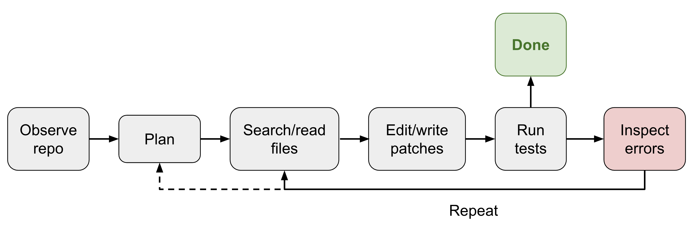
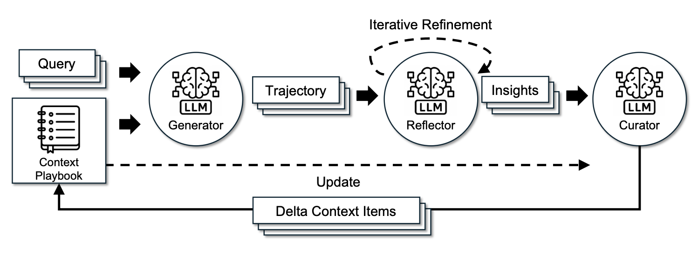
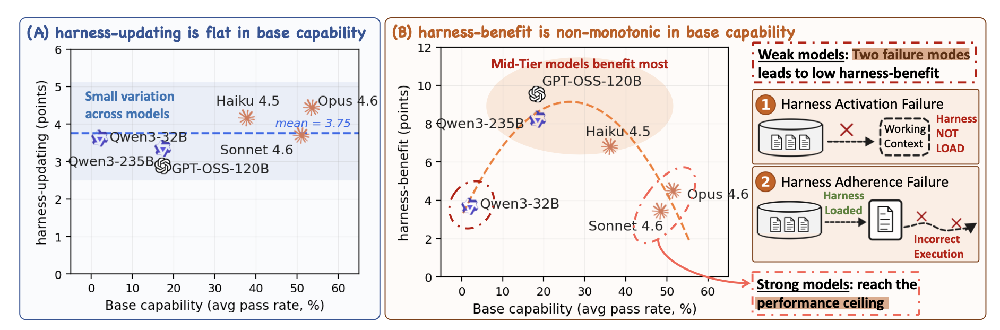
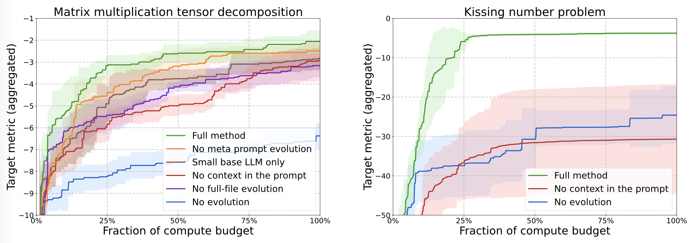
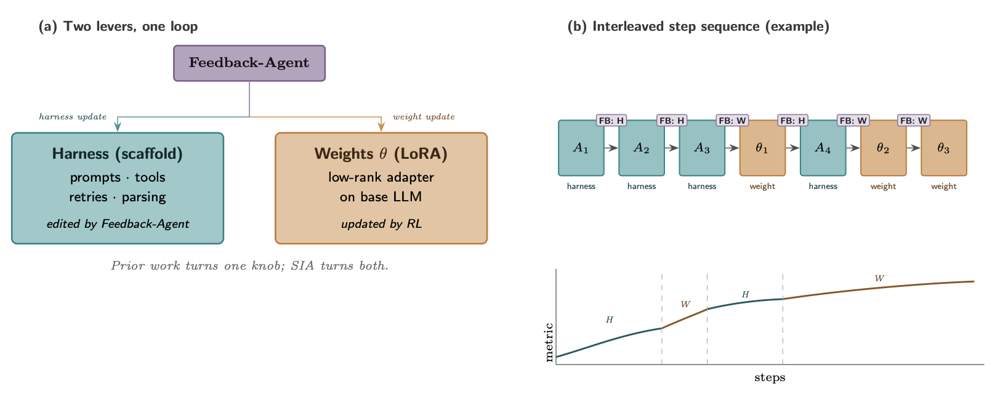

# 面向自我改进的 Harness Engineering

> **译注：** 原文含 18 幅框架示意图（ACE / MCE / Meta-Harness / AFlow / AlphaEvolve / Self-Harness / SIA 等论文的架构图），已全部下载收录于本仓库 `imgs/weng-harness-self-improvement/` 目录，并在译文相应位置随文嵌入，图注保留中文翻译。

递归自我改进（recursive self-improvement，RSI）的概念可以追溯到 I. J. Good（1965）——他把"超智能机器"（ultraintelligent machine）定义为一个能在所有智力活动上超越人类、并能设计出更好的机器来改进自身的系统。Yudkowsky（2008）用"递归自我改进"这个短语指代一种特定的反馈回路：AI 用它当前的智能，去改进产生其智能的认知机器本身。

在现代 AI 中，这个反馈回路可能意味着模型直接重写自己的权重，或者更宽泛地说：模型改进训练管线和部署系统，从而催生一个在有经济价值的任务上表现更好的后继模型。前沿实验室的研究开发速度已被证明在急剧加速（Anthropic；OpenAI）。

我特意提到"部署系统"，因为**原始模型与真实世界上下文之间的那一层，似乎和模型的原始智能（即预训练后立刻做的那些评测）同等重要**。Harness 是 AI 部署的重要组件，Claude Code 和 Codex 这类成功的编码智能体产品已经证明了这一点。**Harness 是围绕基础模型的系统：它编排执行，并决定模型如何思考与规划、如何调用工具与行动、如何感知与管理上下文、如何存储工件、如何评估结果。**

这篇文章聚焦于 harness engineering 相关的研究，以及它如何为 RSI 做贡献。近期大量关于自动化研究（auto-research）、自我改进智能体、进化式程序搜索的工作，都可以围绕这个问题组织起来。另一些关于模型自博弈、合成数据、测试时训练以及更宽泛的持续学习主题的工作（如 Yuan et al. 2024、Chen et al. 2024、Zhao et al. 2025、Choi et al. 2026）同样契合 RSI 愿景，但不是本文的焦点。

## Harness 设计模式

与早期的智能体框架（"agent = LLM + 记忆 + 工具 + 规划 + 行动"）相比，harness engineering 额外包含了工作流设计（例如 loop engineering）、评估、权限控制和持久化状态管理。它不再只是提示词模板，而更接近运行时与软件系统设计：模型如何观察、行动、记忆、自检和改进。

这个设计应当刻意保持简单和通用以利泛化，且最好参照既有的软件工程实践，从预训练知识中获益。操作系统与 harness 之间也有很强的类比：像 OS 一样，harness 应该封装复杂逻辑、保持接口简单。同时，配置、工具接口和其他协议可能会逐渐在业界标准化。

### 模式 1：工作流自动化

定义一个模型可以在其中操作、测试、迭代的工作流，是自动化的关键设计。Karpathy 的 autoresearch 仓库（github.com/karpathy/autoresearch）是这类工作流构造的一个干净示例。常见的工作流遵循一个目标导向的循环：规划、执行、观察/测试、改进、再执行，直到达成目标。这个过程可能会主动向用户发起请求，澄清任务说明或执行偏好。


_图：简化的 Codex agent loop——智能体调用工具，工具响应影响模型的下一次生成。图源：OpenAI Codex agent post_

工作流图还强调：模型分析**自己的轨迹和失败案例**，然后通过一个"agent runtime"（而不是静态提示词模板）迭代推进。

### 模式 2：文件系统即持久记忆

长时程（long-horizon）智能体系统里一个反复出现的模式是：**用简单的控制管理丰富的状态与工件**。Harness 不应该把整个工作流和所有日志都塞在上下文里，而应该把持久状态放在文件里。在长时程智能体 rollout 中，实验日志、代码 diff、论文摘要、错误堆栈、历史 rollout 轨迹等工件，往往比模型训练时对应的上下文窗口长得多。

学会读、写、编辑文件系统（通常经由 `bash` 命令）是 LLM 的基础技能，因此用"文件"这种最简单的形式管理持久记忆，天然能从核心模型能力的提升中获益。

### 模式 3：子智能体与后台任务

Harness 可以派生多个 subagent 并行执行，并监控后台任务。当主智能体需要搜索多个假设、并发跑实验、或在不污染主上下文的情况下委派隔离的子任务时，这非常有用。父智能体因此需要一个小型进程管理器：启动任务、检查日志、取消失败的运行、把结果合并回主智能体线程。

关键的设计选择是**让并行显式且可检查**。如果 subagent 的输出只活在转瞬即逝的聊天上下文里，它们很快就会过时和不可见。如果它们被存成文件、日志和状态记录，模型就能在中断后恢复，并对自己的执行历史进行推理。

### 案例研究：编码智能体 harness

主流编码智能体的核心接口已经在 Claude Code、Codex、OpenCode 和 Cursor 风格的智能体之间趋于稳定。它们普遍使用类似的循环：



_图：主流编码智能体 harness 普遍使用的循环。_

借助一组工具，编码智能体能够在给定仓库中开发和调试问题，就像人类开发者配备了 IDE 一样。

（下表并非完备清单，仅作演示。感兴趣可延伸阅读[这份整理](https://github.com/yasasbanukaofficial/claude-code)。）

| 分组 | 工具定义 |
| --- | --- |
| 文件系统 | 文件发现：`glob`、`grep`、`ls`；文件读取：`read`、`read_many`；文件修改：`write`（整个新文件）、`edit`（字符串精确匹配替换）、`multi_edit`、`apply_patch`（应用结构化补丁/diff） |
| Shell 执行 | 运行命令：`bash`、`PowerShell` |
| IO | `lsp`，git 工具如 `git_status`、`git_diff`、`git_commit` |
| 外部上下文 | MCP 工具、Skills |
| 网络搜索 | `web_search`、`web_fetch`、浏览器工具 |
| 工件 | 读取文档、图片；生成 HTML、图片 |
| 后台进程 | 例如 `CronCreate`、`CronDelete`、`CronList` |
| 智能体委派 | 例如 `spawn_agent`、`resume_agent`、`wait_agent`、`list_agents`、`close_agent`、`interrupt_agent` 等 |

### Harness 层 vs 核心智能？

RSI 的未来会在多大程度上依赖 harness engineering 很难预测，但近期的 RSI 路径不太可能从"模型直接重写自己的权重"开始。我对一条务实的近期路径的预测是：

1. Harness engineering 会朝**元方法论**（meta-methodology）的方向演化（即改进"获得更好答案的机器"，而不只是改进答案本身）。harness 系统本身成为优化目标，启发式规则更少，通用机制更多。
2. 反过来，成熟的 harness 使自动化研究得以服务于模型自我改进的回路，而更聪明的模型防止 harness 过度工程化，让系统可持续。

最终，许多 harness 改进可能会被**内化进核心模型行为**，但与外部上下文和工具的接口应该会保留。我们已经在提示词工程上看到过这个模式的柔和版本：随着指令微调和模型推理能力的提升，手工提示词技巧不再那么核心——但"指明目标、约束、上下文与评估"的需求并没有消失。

## Harness 优化

Harness 系统中被优化对象的递进大致是：**指令提示词 → 结构化上下文 → 工作流 → harness 代码 → 优化器代码**。随着模型越来越聪明和强大，我们迈向更复杂的目标和更通用的方法。

### 上下文工程

把所有工具响应和模型生成简单地追加进上下文，会随着智能体任务时程的显著拉长而迅速失控。上下文管理层的职责是为 LLM 构造更结构化、更简洁的上下文，并管理持久状态。长上下文研究无疑会持续进步，但目前长上下文智能与上下文工程时常纠缠在一起。

**Agentic Context Engineering（ACE；Zhang et al. 2025）**把上下文当作一本**演化中的剧本**（playbook），而不是一段越来越长的提示词。它用三个组件维护一份由要点条目构成的上下文剧本，每条带标识符和描述：

1. **Generator**：产出任务轨迹，过程中引用剧本要点。
2. **Reflector**：从成功和失败的轨迹中蒸馏洞察。
3. **Curator**：以增量的、逐条的方式更新结构化上下文。



_图：ACE 框架。图源：Zhang et al. 2025_

为防止迭代重写导致的上下文坍缩（context collapse）和简短偏置（brevity bias），ACE 的一个关键设计是：curator 不重写完整的提示词块，而是输出一组结构化、逐条的 (identifier, description) 要点，用确定性逻辑合并进结构化的上下文日志，并定期精炼和去重。

ACE 从 rollout 中学习洞察，帮我们迈向自管理记忆，但更新规则和整体工作流仍是手工打造的。为了走向更自我改进的回路，**Meta Context Engineering（MCE；Ye et al. 2026）**把机制（如何管理上下文）与工件内容（上下文里有什么）分离，在元优化层跑技能演化、在基础层跑上下文优化。

一个 MCE 技能 \(s \in \mathcal{S}\) 定义了一个上下文函数 \(c_s=(\rho_s,F_s)\)，把输入 \(x\) 映射到上下文 \(c = F_s(x;\rho_s)\)，其中：

- \(\rho_s = \{\rho_1,\dots,\rho_m\}\) 是静态组件（提示词、知识库、代码库）；
- \(F_s = \{F_1,\dots,F_k\}\) 是动态算子（搜索、选择、过滤、格式化）。

双层优化：内层在训练数据上为技能 \(s\) 找最优上下文 \(c_s^*\)；外层在验证集上找性能最好的技能：

\[ \text{Inner: }c_s^*=\arg\max_{c_s}J_\text{train}(c_s;s)\quad \text{Outer: }s^*=\arg\max_{s\in\mathcal{S}}J_\text{val}(c_s^*) \]

技能数据库记录历史技能、上下文函数与评估指标 \(\mathcal{H}_{k-1} = \{(s_i,c_i,J_i^\text{train}, J_i^\text{val})\}_{i=1}^{k-1}\)。一个元层智能体在既有技能上执行"智能体式杂交"（agentic crossover），为任务 \(\tau\) 生成新技能：\(s_k=\text{crossover}(\tau,\mathcal{H}_{k-1})\)。然后一个基础层的上下文工程师执行技能 \(s_k\)，在当前技能引导下从 rollout 反馈 \(\mathcal{R}_k\) 中学习上下文函数：\(c_k=\text{engineer}(\tau,s_k;c_{k-1}^*,\mathcal{R}_k)\)。


_图：MCE 框架——元层技能演化搜索上下文管理机制，基础层优化任务上下文。图源：Ye et al. 2026_

MCE 不像 ACE 那样强制一条"如何组织上下文"的启发式规则。它用自由形式的技能存储任务最重要的知识，并把技能与技能条件下的上下文一起迭代演化。实现上，一个上下文函数 \(c\) 被实例化为专用目录里的一组文件，既包含静态组件（`skill.md`）也包含动态组件（上下文与数据 rollout）。元层与基础层的优化都在智能体编码环境中执行，工具集为标准的

\[ \mathcal{T}=\{\texttt{Read},\texttt{Write},\texttt{Edit},\texttt{Bash},\texttt{Glob},\texttt{Grep},\texttt{TodoWrite}\} \]

**Meta-Harness（Lee et al. 2026）**再深入一层：被优化的对象是**决定并优化"哪些信息应被存储、取回、呈现给模型"的那份代码**。名字里的"Meta-"意味着它是一个用于优化 harness 的 harness。


_图：Meta-Harness 外循环优化算法。图源：Lee et al. 2026_

创建新 harness 的提议器（proposer）本身就是一个编码智能体，最终输出是帕累托前沿上的一组 harness 候选：

- 完整的执行历史经文件系统可访问，因此编码智能体用 `grep`、`cat` 这类命令翻阅它，而不是把所有东西铲进单个提示词上下文；
- 提议的 harness 是文件系统里的一个字典，包含自己的源代码、分数、rollout 轨迹和状态更新；
- 元 harness 循环迭代地创建新 harness，只保留合格的。


_图：Meta-Harness 在文本分类（少量迭代）与 TerminalBench-2 上的性能。注意 TerminalBench-2 实验的搜索从 Terminus-KIRA 和 Terminus-2 这两个非常强的 harness 初始化。图源：Lee et al. 2026_

重要的教训很清晰：**一旦 harness 设计变成一个可执行的搜索空间，一个强编码智能体就能利用人类工程师所用的同一个设计空间。**

### 工作流设计

Harness engineering 中的工作流设计可以由领域专家手工打造。以自动化研究为例，已有多种框架被提出和检验。AI Scientist 系统（Lu et al. 2026）构建了一条管线：提出研究想法、写代码、跑实验、分析结果、写稿、做同行评审。Meng et al.（2026）在 ScientistOne 中把**可验证性**作为中心设计约束：每一个断言（引用、数值、方法、结论）都必须溯源到证据来源，并由证据链（Chain-of-Evidence）检查审计。


_图：AI Scientist 的想法生成、实验、写作与评审管线。图源：Lu et al. 2026_

Autodata 智能体（Kulikov et al. 2026）被设计成生成训练和评估数据的"数据科学家"。主智能体管理一个提出问题的 challenger、一个弱 solver、一个强 solver 和一个 verifier/judge，目标是合成"难度刚刚好"的数据——强 solver 做得出而弱 solver 做不出。Autodata 中 challenger 的提示词根据 solver 和 verifier 的反馈迭代更新。局限在于：合成任务被用于微调弱 solver 而非强 solver；如果回路不能迭代改进强模型，它更像是在一个生成的提示词分布上做间接蒸馏，RSI 的味道就淡了。


_图：Autodata 围绕 challenger、solver、verifier 角色的智能体工作流。图源：Kulikov et al. 2026_

工作流的设计空间是巨大的，我们自然会把工作流设计当作一个**搜索问题**——因此应该能靠算法而不只是手工来找到好解。沿着这个方向，**Automated Design of Agentic Systems（ADAS；Hu et al. 2025）**把智能体设计本身表述为一个优化问题——"元智能体搜索"（meta-agent search）：由一个元智能体来编程新的智能体工作流设计。

1. 用简单智能体（如 CoT、self-refine）初始化一个智能体工作流档案（archive）。
2. 让元智能体受档案中既有方案启发，**以代码形式**编写新的智能体。
3. 元智能体先生成新工作流的高层描述，再用代码实现；草稿程序经过两轮 self-refine（让模型给出反馈、再让同一个模型基于反馈精炼此前的输出；Madaan et al. 2023），检查新颖性。
4. 评估每个新候选，把成功的加回档案。
5. 重复步骤 2–4 直到达到最大迭代数。


_图：ADAS 示意。图源：Hu et al. 2025_

**AFlow（Zhang et al. 2025）**把智能体工作流表示为一张图：节点是调用 LLM 的动作，边用代码实现逻辑操作。工作流优化依赖 MCTS（蒙特卡洛树搜索）：

1. 用模板初始化树中的起始工作流 \(W_0\)。
2. 按"分数 + 均匀探索"的软混合选择一个工作流节点。
3. 让 LLM 在其评估表现的条件下产出一个修改版工作流，完成扩展。
4. 执行并评估新工作流。
5. 若在 \(N\) 轮预算内表现出改进，则加回树中。
6. 重复步骤 2–5，当 top-k 平均分进入平台期或预算耗尽时停止。


_图：AFlow 在工作流候选树上的优化过程。图源：Zhang et al. 2025_

AFlow 在 QA、代码、数学任务上的实验显示，它对人工设计的工作流和 ADAS 都有不错的提升。


_图：AFlow 与人工设计方法及 ADAS 的实验对比。图源：Zhang et al. 2025_

### 自我改进的 Harness

上下文工程或工作流设计都只是 harness 的一部分。我们需要搜索**整个设计空间**，把上下文管理逻辑、工作流、权限和许多其他 harness 组件放在一起优化。正如在 Meta-Harness、ADAS、AFlow 中看到的，✨代码✨ 是定义程序和系统的通用语言。简单说，**harness 就是一份代码，它编程了提示词、工具调用、subagent、控制流、记忆和工作流逻辑如何协同工作**。如果 LLM 能优化执行智能体的代码，它就能触及比手写提示词大得多的设计空间。

**Self-Taught Optimizer（STOP；Zelikman et al. 2023）**是递归式脚手架改进的早期例子之一。在第 \(t=0\) 步，种子改进器 \(I_0\) 接受初始解 \(s\)、效用函数 \(u\) 和黑盒语言模型 \(M\)，返回改进解 \(s' = I(u, s; M)\)。STOP 的目标不是直接改进 \(s\)，而是**改进改进器 \(I\) 本身**。

先定义元效用（meta-utility）为改进器 \(I\) 在一组下游任务 \(\mathcal{D}\) 上的平均效用：

\[ \hat{u}(I) \triangleq \frac{1}{\vert\mathcal{D}\vert}\mathbb{E}_{(u,s)\sim \mathcal{D}}[u(I(u,s; M))] \]

因为改进"改进器函数"本身也是一个优化问题，我们可以基于 \(I_{t-1}\) 按元效用递归得到新版本：

\[ I_t=I_{t-1}(\hat{u},I_{t-1};M) \]


_图：STOP 算法。图源：Zelikman et al. 2023_

实验中，被改进的改进器发现了多种策略：遗传算法、分解后逐部分改进、多臂提示词老虎机、模拟退火、变温采样、beam/树搜索。这与"harness 工作流可以被表示为优化对象"是同构的。


_图：STOP 发现的自我改进策略示例。图源：Zelikman et al. 2023_

Zelikman et al.（2023）的发现里有一个警示：STOP 用 GPT-4 时跨迭代提升了平均下游性能，但用较弱的模型（GPT-3.5、Mixtral）反而退化。**仅有递归结构是不够的：基础模型必须有足够能力去改进机制本身。**这意味着 harness 改进能让模型部署得更好，但智能仍然是核心。

Lin et al.（2026）更细致地研究了 harness 演化对模型能力的依赖，拆开了两条轴：(1) **harness-updating**——产出有用 harness 编辑的能力；(2) **harness-benefit**——利用更新后的 harness 取得更好任务解决的能力。有趣的是，从 Qwen3.5-9B 到 Claude Opus 4.6 的一系列不同尺寸与核心智能的模型，在实验中表现出**相近的 harness 更新能力**——9B 的 harness 提议器/演化器能写出与 Opus 程序上同构的 skill。而要**最好地利用**一个 harness，模型需要正确且及时地调用 skills/工具，并擅长长时程指令遵循。



_图：主要结果——(A) harness 更新能力在 Qwen2-32B 到 Opus 4.6 的模型范围内测得平坦；(B) harness 受益能力非单调，中档模型受益最多。图源：Lin et al. 2026_

更新的工作 **Self-Harness（Zhang et al. 2026）**依靠 LLM 智能体经由"提议—评估—接受"循环改进自己的 harness。


_图：Self-Harness 用"弱点挖掘、有界 harness 提议、验证"的循环更新 harness。图源：Zhang et al. 2026_

Self-Harness 的循环有三个阶段：

1. **弱点挖掘（Weakness Mining）**：把失败聚类成有验证器根据的失败模式。当前 harness \(h_t\) 被用于任务评估并收集执行轨迹。注意两次运行可能在错误日志表面共享同一个验证器结果（如超时、缺工件），而因果机制不同——因此需要信息丰富的失败记录（终端验证器层面的原因、相关智能体行为的因果状态、轨迹暴露的抽象智能体机制）来揭示根因。
2. **Harness 提议（Harness Proposal）**：基于挖掘出的失败模式提出**有界的** harness 编辑。同一个模型在 \(h_t\) 下作为提议器被调用，输入一个有界的提议上下文：(1) 当前 harness 的可编辑面；(2) 有验证器根据的失败模式；(3) 应当保留的通过行为记录；(4) 此前尝试过的编辑摘要。编辑应偏向可解决、且能通过窄小改动解决的复发性错误模式（而非任务特定的难度），并保持彼此不同且多样。
3. **提议验证（Proposal Validation）**：验证并合并合格的编辑，产出新 harness \(h_{t+1}\)。候选编辑用回归测试评估：held-in 集 \(D_\text{in}\)（检验弱点是否解决）与 held-out 集 \(D_\text{out}\)（检查是否引入其他未知问题）。只有在两个集合上都无回归的候选才被接受合并；被拒绝的候选记录在案但不改动生效中的 harness。

在 Terminal-Bench-2 上运行 `MiniMax M2.5`、`Qwen3.5-35B-A3B` 和 `GLM-5` 时，Self-Harness 被证明能学出**模型特定**的 harness 指令，针对不同基础模型的不同弱点，并提升 held-out 通过率。

这类 self-harness 工作确实让我担忧：如果允许一个程序编辑操作系统，抽象边界就被打破了。可编辑面需要恰当设计，权限控制与安全层需要活在这个回路**之外**。奖励劫持（reward hacking）的所有挑战依然存在。

**Agentic Harness Engineering（AHE；Lin et al. 2026）**认为 harness 演化的瓶颈在**可观测性**——rollout 失败时，我们需要知道哪个组件该负责，每次编辑都应有证据支撑。该框架用三根可观测性支柱构成闭环：

1. **组件可观测性**：每个可编辑的 harness 组件都在文件系统里有表示，动作空间显式且可追溯。一个 harness 含 7 个组件：系统提示词、工具描述、工具实现、中间件、skill、subagent 配置、长期记忆。每个失败模式映射到一个组件，编辑因此更有针对性。
2. **经验可观测性**：把海量原始轨迹分析、总结成分层证据与失败模式。每个 harness 生成 \(k\) 条轨迹；用一个"Agent debugger"智能体分析每条（各存一个文件）并产出按任务的根因分析报告（无论成败）；所有按任务报告聚合成一份基准总览供下一步使用，需要时可回溯原始轨迹。这种分层访问结构更省 token。
3. **决策可观测性**：每次编辑配一个供下一轮验证的预测。一个"Evolve agent"读仓库、决定编辑哪个组件、产出编辑及其理由。每次编辑都是一个文件级的、可证伪的断言，并受两个约束：(1) 编辑只作用于 harness 工作区——runs 目录、tracer、verifier、LLM 配置只读，这禁掉了一批奖励劫持（如关掉验证器、换模型、加推理预算），使每一笔收益都可归因于 harness 编辑；(2) 编辑必须证据驱动，附带 manifesto 条目：失败证据名称、推断的根因、针对性修复、以及包含预期修复与风险回归的影响预测。

在 Terminal-Bench-2 上，AHE 超过了人工设计的 harness（OpenCode、Terminus-2、Codex——Hard 档除外）和若干自演化基线（ACE、TF-GRPO）。同一个冻结的 harness 不再演化也能迁移到 SWE-bench-verified，说明演化出的 harness 把工程经验编码进了 harness 组件，而不是做基准特定的优化。

### 进化式搜索

进化搜索是受自然选择启发的优化方法（参见我此前关于进化算法的文章）：演化一个解的种群，变异它们，只保留"适应度"高的。进化搜索在这两种情况下派上用场：(1) 搜索空间庞大或形状怪异；(2) 难以直接用梯度优化、但解容易评估。Harness 搜索看起来正合适。

进化搜索此前已被用于提示词工程。Promptbreeder（Fernando et al. 2023）通过丰富的变异操作优化任务特定提示词，而且有趣的是，变异提示词（即指示 LLM 变异任务提示词的指令）本身也在进化中被改进。GEPA（Agrawal et al. 2025）把基于反思的提示与进化搜索结合，用对试错轨迹的自然语言反思来提出提示词更新。

Novikov et al.（2025）提出的 **AlphaEvolve** 是一个编码智能体进化搜索系统：存一池候选程序，提示冻结的 LLM 生成改进 diff。系统反复评估子程序、保留成功者，随时间发现更好的解。


_图：AlphaEvolve 工作原理。图源：Novikov et al. 2025_

AlphaEvolve 设计中的几个细节很关键：

- 提示词包含父程序、结果、指令，有时还有元信息；
- 编码智能体可访问完整仓库，但待改进的代码区域用 `# EVOLVE-BLOCK-START` 和 `# EVOLVE-BLOCK-END` 显式标注；
- 元提示词（meta-prompt）随指令与上下文共同演化（由 LLM 建议），方式与演化解程序类似。

消融实验显示了进化流程、提示词中的上下文、元提示词、全文件演化以及更强 LLM 的价值。



_图：消融实验展示了 AlphaEvolve 中若干设计的价值。图源：Novikov et al. 2025_

近期变体中，ThetaEvolve（Wang et al. 2025）把进化搜索与 RL 和上下文内学习结合；DemoEvolve（Che et al. 2026）把人类专家演示作为参考经验加进自 rollout 档案，用于 harness 层面的诊断与编辑。ShinkaEvolve（Lange et al. 2025）则引入三个新组件提高 LLM 采样效率：

- 通过平衡"性能排名"与"子代数量"的父代采样，实现更样本高效的探索；
- 基于嵌入余弦相似度的代码新颖性拒绝采样，丢弃与现有种群过于相似的候选；
- 在元便签（meta-scratchpad）中识别成功解的好模式，引导未来变异。

与上述聚焦"解的改进"的方法不同，**Darwin Gödel Machine（DGM；Zhang et al. 2025）**显式针对"可编辑的 harness 代码仓库"做演化，执行者是一个 LLM 编码智能体——确切地说，这个智能体被允许修改**它自己的 harness**。后续工作 Hyperagents（Zhang et al. 2026）引入了一个元智能体，控制如何修改现有任务智能体来创造新智能体。

1. 从池中的一个编码智能体开始。
2. 每轮迭代按"性能成正比、子代数成反比"的概率选一个父代，修改并分支出新智能体。
3. 被选中的父代检查自己的基准评估日志，然后对自己的 harness 代码库提出改进，生成新版编码智能体。代码编辑用两个基础工具实现：(1) bash（参数：`<bash_command>`）；(2) editor（参数：`view/create/edit <file_path>`）。
4. 评估新编码智能体，只有性能足够高的才加回池子。
5. 重复步骤 2–4 直到停止条件。

DGM 是**固定模型下的 harness 演化**。在以 `Claude 3.5 Sonnet` 为基础 LLM、简单初始 harness 配置的实验中，DGM 发现的智能体在 SWE-bench Verified（20% → 50%）和 Polyglot（14.2% → 30.7%）上与手工打造的智能体相当或更好。

这族方法在候选解可自动评估、适应度容易量化的领域表现良好，比如矩阵乘法、GPU kernel 优化、算法竞赛、数据中心调度。在评估缓慢、含糊或主要靠启发式的领域则表现挣扎。进化的计算效率与有效性也是顾虑。

### 与模型权重的联合优化

Harness 演化改变的是模型周围的非参数系统。要实现完全的自我改进，完全可以允许模型同时更新自己的权重。权重更新可以经由训练管线的改进或测试时的持续学习实现（持续学习值得未来单独写一篇）。

**SIA（Hebbar et al. 2026）**是把 harness 改进与模型参数更新放进同一个优化回路的早期尝试，设计里有三个组件：

- **Meta-Agent**：提出初始 harness；
- **Task-Specific Agent**：执行任务；
- **Feedback-Agent**：基于近期轨迹选择更新 harness 还是更新模型权重。



_图：SIA 中的 Feedback-Agent 决定下一轮迭代类型。图源：Hebbar et al. 2026_

SIA 实验中有一些混淆因素让结果难以解读：比如任务智能体比 Meta-Agent 和 Feedback-Agent 用的模型弱得多（`gpt-oss-120b` vs `Claude Sonnet 4.6`），基线也太弱、难与相关方法干净地交叉对照。我认为这个方向有趣，但证据还是初步的。训练稳定性、Goodhart 效应等诸多挑战仍然开放。

**Continual Harness（Karten et al. 2026）**在长时程游戏环境中实验了"harness 更新 + 联合学习策略模型"：对低奖励轨迹蒸馏强教师模型的标注。

## 未来挑战

AI Scientist 这条线有力地证明了：专家设计的 harness 能协调自动化研究回路的很大一部分（以写研究论文的形式做了实验）。但**论文产出不等于科学发现**。一个系统可以写出貌似可信的手稿，却仍然带着编造的引用、实现漂移或孱弱的实验结果。

Trehan & Chopra（2026）测试了 LLM 能否用最小脚手架和基础工具（`read_file`、`write_file`、`llm_search`、`list_files`）从研究想法走到论文。每个想法有一个专属工作区，智能体可以生成和读取文档作为上下文的一部分。他们在三个领域（世界模型、多智能体 RL、AI 安全与对齐）实验，每个领域有 45–50 份高质量种子文档以启发新想法。只有四个想法被人类专家选中跑完整管线，只有一个被完整执行成论文。他们观察到六种反复出现的失败模式：

- **偏向训练数据默认值**：用旧库、过期命令、标准格式，或做出与实际仓库/数据集不符的假设。
- **执行压力下的实现漂移**：实现变得技术复杂时，模型会滑向一个常见的更简单方案，而不是所提出的方法。
- **记忆与上下文退化**：长时程项目会丢失关键细节，除非日志被写成持久工件。
- **过度乐观**：实验嘈杂或失败时模型也宣称成功。Bubeck et al.（2025）观察到类似的"p-hacking 与 eureka-ing"模式——模型会引入"数值胶带"（numerical duct tape），在信号还是噪声时宣布胜利。
- **领域智能不足**：模型缺少隐性的工艺知识，例如预估实现复杂度、判断实验结果是否可信、知道哪些基线重要。
- **科学品味孱弱**：实验可以执行，却回答不了正确的问题。

朝向完整的 RSI，研究者们已取得实质进展，但若干瓶颈仍在：

**1. 弱而模糊的评估器。** 许多研究断言没有快速而精确的验证器，许多真实世界任务也是如此。当前的自我改进回路在评估指标可测量、客观时工作得最好——和 RL 的工作条件类似。研究品味、新颖性和长期科学价值要难测得多：研究品味常常混合了问题表述、实验设计、以及"哪些意外结果值得追、哪些失败案例值得重试"的判断。

**2. 上下文与记忆的生命周期。** 随着 AI 智能体更自主、更独立，记忆会增长。有用的 harness 需要管理上下文与记忆，弥补长上下文生成的现存局限，同时最大化长时程任务的成功。人类能维持一生的记忆，我在这里看到一个类比：**上下文工程将会、也应该成为智能的核心部分，而不是停留在软件系统层。**

**3. 负面结果。** 研究者有发表成功结果的激励，文献因此偏向成功。在海量（至少目前主要由人类创造的，lol）数据上训练的 LLM，可能因为数据中成败案例的失衡，而不擅长决定何时放弃一个假设、报告一个负面结果、甚至承认一次失败。研究 harness 应该让失败的尝试易于保存——**从失败中学习是裁剪任务搜索空间的最好方式**。

**4. 多样性坍缩。** 进化和 RL 回路倾向于利用已知的高奖励模式。我们需要防止种群坍缩成同一个解的变体的机制。这对开放式研究尤其关键——最好的路径在当前评估器下最初可能看起来更差。

**5. 奖励劫持。** 自我改进回路会优化任何给它的信号。如果奖励来自单元测试，智能体可能对测试过拟合；来自裁判模型，它可能学会针对这个裁判的劫持技巧；来自基准分数，它可能利用基准的伪影。**评估器与权限控制大概率应该位于演化 harness 的回路之外**，配以留出测试、轨迹审计、以及在要紧决策点的人类评审——多少监督可以被规模化和自动化，仍是开放的研究领域。

**6. 长期成功。** 外在的优化回路作用于我们能在训练沙箱中模拟的单次 rollout 之外的奖励。以编码智能体为例：它们已经提升了软件工程的日常生产力，但许多优化目标仍然太短期。它常常能完成手头的任务，但"如何保护一个由数百上千工程师共同维护的仓库的长期健康"就没那么显然了。标准的沙箱 RLVR 式训练很少捕捉可维护性、所有权边界、迁移成本、向后兼容、未来的调试负担。

**7. 人类的角色。** **人类应该在栈上向上移动，而不是被移出回路**——意味着人类应该在正确的时间、正确的抽象层级提供监督，而我们的系统设计应该考虑何时、如何设置这些触点。

上面列出的许多挑战都需要人类的反馈与掌舵。毕竟，我们构建这项技术是为了人类更好的未来，而不是反过来。

## 附录：一些有用的基准

- **PaperBench**：从零复现 20 篇 ICML 2024 Spotlight/Oral 论文，包括理解论文贡献、开发代码库、成功执行实验。每个复现任务分解为更小的可单独评分的任务；共 8,316 条评分标准，与论文作者共同开发。当时最好的模型（`Claude 3.5 Sonnet`，约 21%）没有超过 ML 博士。含 PaperBench、PaperBench Code-Dev（轻量版）与 JudgeEval。
- **CORE-Bench**：评估已发表研究的计算可复现性。基于 90 篇论文（计算机科学、社会科学、医学）的 270 个任务；任务是用提供的代码和数据复现结果；含多个难度级别、纯语言与视觉-语言任务。当时最好的智能体（`GPT-4o` 与 `GPT-4o-mini`）在最难任务上只有 21% 准确率。
- **ScienceAgentBench**：评估数据驱动科学发现的 LLM 智能体。从 44 篇同行评审出版物中提取 102 个任务，横跨数学、化学、生物、地理四个学科；覆盖这些领域的基础数据科学任务：数据处理、模型开发、数据分析、信息可视化。
- **RE-Bench**：在真实 ML 研究工程环境中把前沿 AI 智能体与人类专家对照。7 个有挑战性的开放式 ML 研究工程环境；每个环境 =（评分函数，起始解，参考解），都能在 8 块以内 H100 上运行。例子：优化一个 kernel、跑一个 scaling law 实验、修一个 embedding、微调 GPT-2 做 QA 等。含 61 位人类专家的 71 次 8 小时尝试的数据。人类专家在 82% 的 8 小时尝试中拿到非零分；24% 达到或超过强参考解。最好的 AI 智能体在 2 小时预算下得分是人类的 4 倍，但人类在更长预算下回报更高，在 8 小时和 32 小时设置下反超智能体。
- **MLE-bench**：在离线 Kaggle 竞赛上评估 ML 工程智能体。含 75 个从 Kaggle 精选的 ML 工程竞赛；测试训练模型、准备数据集、跑实验、向评分脚本提交预测；用 Kaggle 公开排行榜作为人类基线。论文中最好的配置（`o1-preview` + AIDE 脚手架）在 16.9% 的竞赛中达到 Kaggle 铜牌以上水平。含资源扩展与数据污染分析。
- **KernelBench**：评估生成的 GPU kernel 的正确性与速度。250 个 PyTorch 任务，评估 LLM 能否写出快且正确的 kernel；评估指标 fast_p = 正确且快于基线的生成 kernel 百分比。

## 引用

> Weng, Lilian. "Harness Engineering for Self-Improvement". Lil'Log (Jul 2026). https://lilianweng.github.io/posts/2026-07-04-harness/

```bibtex
@article{weng2026harness,
  title = {Harness Engineering for Self-Improvement},
  author = {Weng, Lilian},
  journal = {lilianweng.github.io},
  year = {2026},
  month = {July},
  url = "https://lilianweng.github.io/posts/2026-07-04-harness/"
}
```

## 参考文献（保留原文）

[1] Good, I. J. "Speculations Concerning the First Ultraintelligent Machine." Advances in Computers, 6:31–88, 1965.

[2] Yudkowsky, Eliezer. "Recursive Self-Improvement." LessWrong, 2008.

[3] Choi, et al. "Anchored Self-Play for Code Repair." ICML 2026.

[4] Zhao, et al. "Absolute Zero: Reinforced Self-play Reasoning with Zero Data." arXiv:2505.03335, 2025.

[5] Yuan, et al. "Self-Rewarding Language Models." arXiv:2401.10020, 2024.

[6] Chen, et al. "Self-Play Fine-Tuning Converts Weak Language Models to Strong Language Models." ICML 2024.

[7] Zhang, et al. "Agentic Context Engineering: Evolving Contexts for Self-Improving Language Models." ICLR 2026.

[8] Ye, et al. "Meta Context Engineering via Agentic Skill Evolution." arXiv:2601.21557, 2026.

[9] Lee, et al. "Meta-Harness: End-to-End Optimization of Model Harnesses." arXiv:2603.28052, 2026.

[10] Lu, et al. "Towards end-to-end automation of AI research." Nature, 651:914–919, 2026.

[11] Meng, et al. "ScientistOne: Towards Human-Level Autonomous Research via Chain-of-Evidence." arXiv:2605.26340, 2026.

[12] Kulikov, et al. "Autodata: An agentic data scientist to create high quality synthetic data." arXiv:2606.25996, 2026.

[13] Hu, Lu, and Clune. "Automated Design of Agentic Systems." ICLR 2025.

[14] Madaan, et al. "Self-Refine: Iterative Refinement with Self-Feedback." NeurIPS 2023.

[15] Zhang, et al. "AFlow: Automating Agentic Workflow Generation." ICLR 2025.

[16] Zelikman, et al. "Self-Taught Optimizer (STOP): Recursively Self-Improving Code Generation." COLM 2024.

[17] Zhang, et al. "Self-Harness: Harnesses That Improve Themselves." arXiv:2606.09498, 2026.

[18] Fernando, et al. "Promptbreeder: Self-Referential Self-Improvement Via Prompt Evolution." arXiv:2309.16797, 2023.

[19] Agrawal, A. et al. "GEPA: Reflective Prompt Evolution Can Outperform Reinforcement Learning." arXiv:2507.19457, 2025.

[20] Novikov, et al. "AlphaEvolve: A coding agent for scientific and algorithmic discovery." arXiv:2506.13131, 2025.

[21] Lange, Imajuku, and Cetin. "ShinkaEvolve: Towards Open-Ended And Sample-Efficient Program Evolution." arXiv:2509.19349, 2025.

[22] Wang, et al. "ThetaEvolve: Test-time Learning on Open Problems." arXiv:2511.23473, 2025.

[23] Zhang, et al. "Darwin Gödel Machine: Open-Ended Evolution of Self-Improving Agents." arXiv:2505.22954, 2025.

[24] Zhang, et al. "Hyperagents." arXiv:2603.19461, 2026.

[25] Yuksekgonul, et al. "Learning to Discover at Test Time." arXiv:2601.16175, 2026.

[26] Riaz, et al. "Epistemic Uncertainty for Test-Time Discovery." arXiv:2605.11328, 2026.

[27] Hebbar, et al. "SIA: Self Improving AI with Harness & Weight Updates." arXiv:2605.27276, 2026.

[28] Trehan and Chopra. "Why LLMs Aren't Scientists Yet: Lessons from Four Autonomous Research Attempts." arXiv:2601.03315, 2026.

[29] Bubeck, et al. "Early science acceleration experiments with GPT-5." arXiv:2511.16072, 2025.

[30] Starace, et al. "PaperBench: Evaluating AI's Ability to Replicate AI Research." ICML 2025.

[31] Wijk, et al. "RE-Bench: Evaluating frontier AI R&D capabilities of language model agents against human experts." ICML 2025.

[32] Chan, et al. "MLE-bench: Evaluating Machine Learning Agents on Machine Learning Engineering." arXiv:2410.07095, 2024.

[33] Chen, et al. "ScienceAgentBench: Toward Rigorous Assessment of Language Agents for Data-Driven Scientific Discovery." ICLR 2025.

[34] Siegel, et al. "CORE-Bench: Fostering the Credibility of Published Research Through a Computational Reproducibility Agent Benchmark." TMLR 2024.

[35] Ouyang, et al. "KernelBench: Can LLMs Write Efficient GPU Kernels?" arXiv:2502.10517, 2025.

[36] Lin, et al. "Harness Updating Is Not Harness Benefit: Disentangling Evolution Capabilities in Self-Evolving LLM Agents." arXiv:2605.30621, 2026.

[37] Lin, et al. "Agentic Harness Engineering: Observability-Driven Automatic Evolution of Coding-Agent Harnesses." arXiv:2604.25850, 2026.

[38] Karten, et al. "Continual Harness: Online Adaptation for Self-Improving Foundation Agents." arXiv:2605.09998, 2026.

[39] Che, et al. "DemoEvolve: Overcoming Sparse Feedback in Agentic Harness Evolution with Demonstrations." arXiv:2605.24539, 2026.
